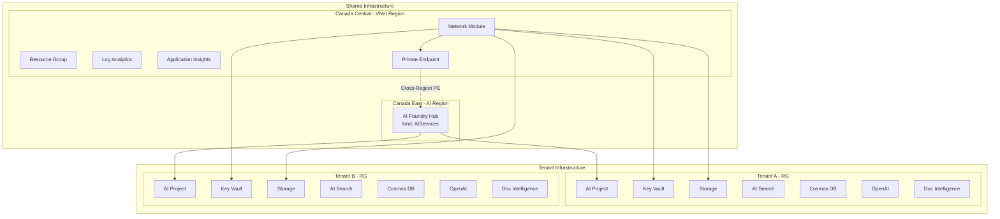
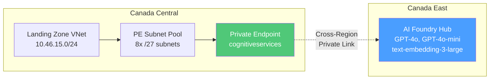
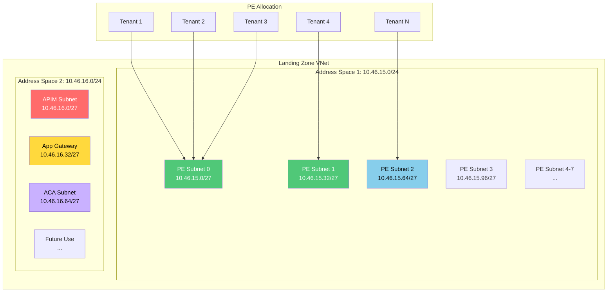
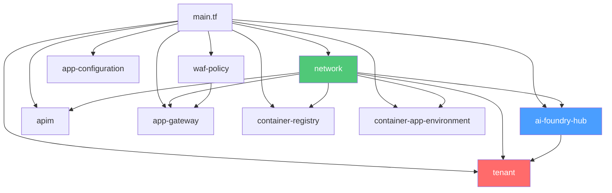
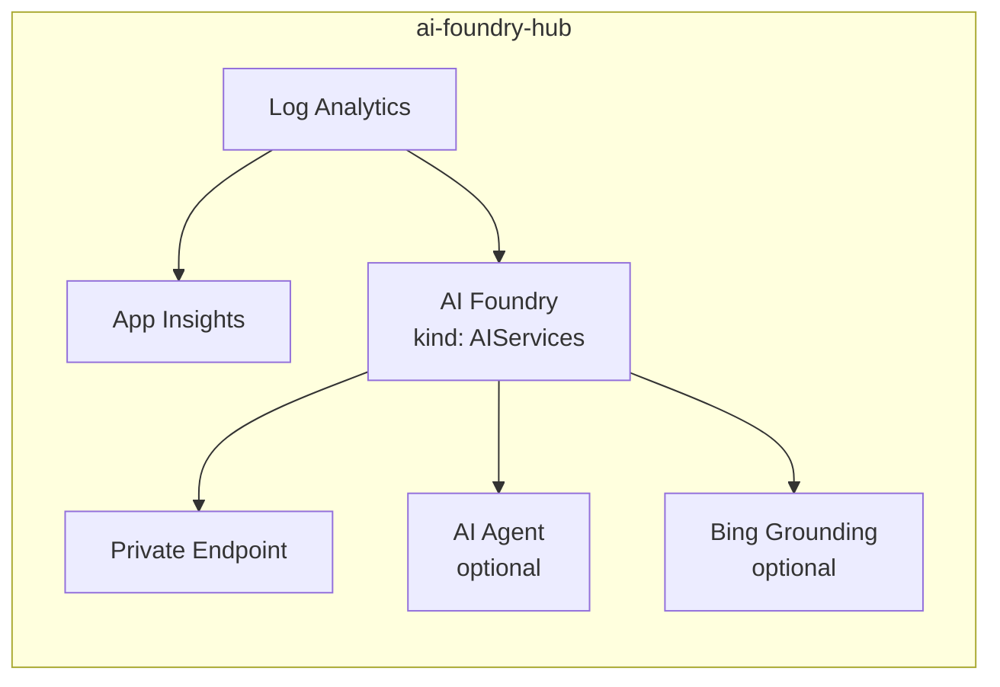
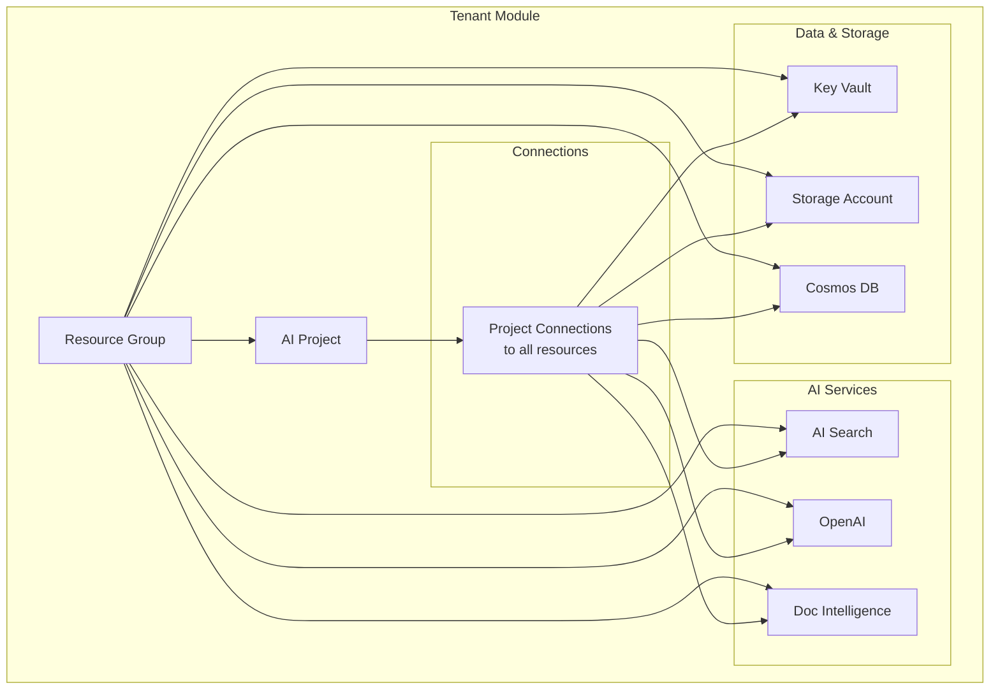
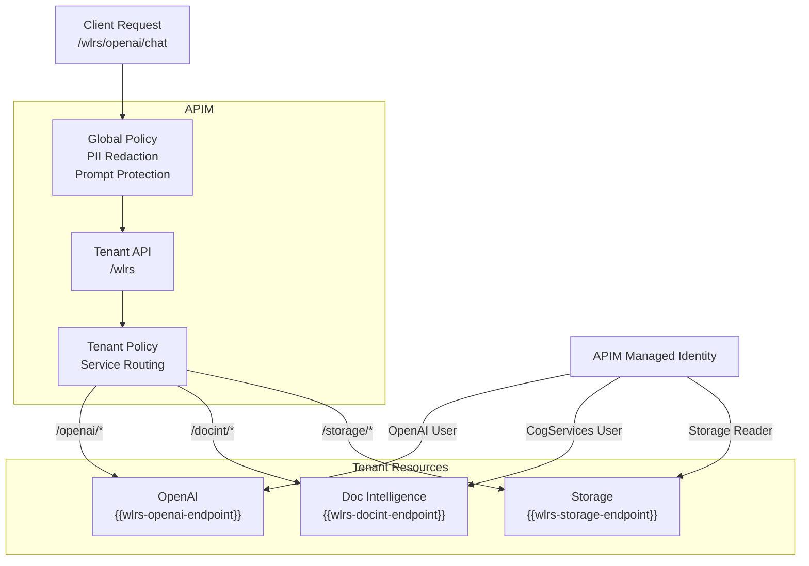
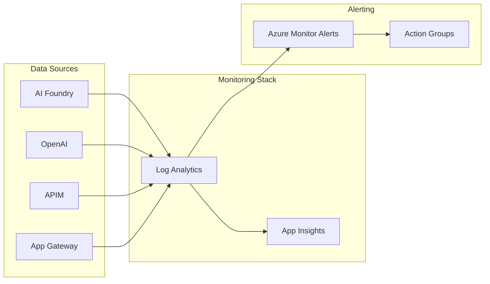
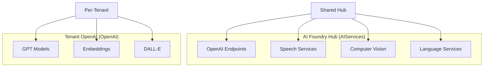

# AI Foundry Multi-Tenant Infrastructure

Enterprise-grade Azure AI Foundry platform with full tenant isolation, private networking, and cross-region model deployment.

## Table of Contents

- [Architecture Overview](#architecture-overview)
- [Cross-Region Deployment](#cross-region-deployment)
- [Network Architecture](#network-architecture)
- [Module Reference](#module-reference)
- [Tenant Configuration](#tenant-configuration)
- [Operations Runbook](#operations-runbook)
- [Troubleshooting](#troubleshooting)

---

## Architecture Overview

This infrastructure deploys a multi-tenant AI platform on Azure with the following design principles:

- **Tenant Isolation**: Each tenant gets dedicated resources in a separate resource group
- **Private Networking**: All PaaS services use private endpoints within an Azure Landing Zone
- **Cross-Region AI**: AI Foundry Hub deployed to regions with model availability (e.g., Canada East)
- **Cost Attribution**: Per-tenant resource groups enable accurate cost tracking
- **Policy-Managed DNS**: Integrates with Azure Landing Zone policy-managed private DNS zones



### Component Summary

| Component | Purpose | Location |
|-----------|---------|----------|
| AI Foundry Hub | Shared AI Services account with OpenAI endpoints | Canada East |
| AI Projects | Per-tenant project within the Hub | Linked to Hub |
| Log Analytics | Centralized logging and diagnostics | Canada Central |
| Application Insights | APM and tracing for AI applications | Canada Central |
| Private Endpoints | Secure connectivity to all PaaS services | Canada Central |

---

## Cross-Region Deployment

Azure OpenAI models have varying regional availability. This infrastructure supports deploying AI services to a different region than the VNet for model access.



### Configuration

```hcl
module "ai_foundry_hub" {
  source = "./modules/ai-foundry-hub"
  
  name     = "ai-hub-prod"
  location = "canadacentral"  # VNet and PE location
  ai_location = "canadaeast"  # AI Foundry Hub location (for models)
  
  # ... other configuration
}
```

### Available Models by Region

| Model | Canada Central | Canada East |
|-------|----------------|-------------|
| GPT-4o | ❌ | ✅ |
| GPT-4o-mini | ❌ | ✅ |
| text-embedding-3-large | ❌ | ✅ |
| GPT-4 Turbo | ✅ | ✅ |

---

## Network Architecture

The network module creates a scalable subnet architecture that supports tenant growth.



### Subnet Allocation Strategy

| # of /24s | PE Pool | APIM | AppGW | ACA |
|-----------|---------|------|-------|-----|
| 1 | .0/27 | .32/27 | .64/27 | .96/27 |
| 2 | 1st /24 (8x/27) | 2nd .0/27 | 2nd .32/27 | 2nd .64/27 |
| 4+ | 1st+2nd (16x/27) | 3rd .0/27 | 4th .0/27 | 4th .32/27 |

### PE Subnet Pool

Each /27 subnet provides ~27 usable IPs (5 reserved by Azure). With 10 private endpoints per tenant average:

| Environment | Address Spaces | PE Subnets | Max Tenants |
|-------------|---------------|------------|-------------|
| Test | 2 x /24 | 8 | ~20 |
| Prod | 4 x /24 | 16 | ~40+ |

---

## Module Reference

### Module Dependency Graph



---

### 1. Network Module

**Path**: `modules/network`

Creates subnet infrastructure with NSGs for the Landing Zone VNet.

#### Inputs

| Name | Type | Required | Description |
|------|------|----------|-------------|
| `name_prefix` | string | ✅ | Prefix for resource names |
| `vnet_name` | string | ✅ | Existing VNet name |
| `vnet_resource_group_name` | string | ✅ | VNet resource group |
| `target_vnet_address_spaces` | list(string) | ✅ | VNet address spaces |
| `source_vnet_address_space` | string | ✅ | Source VNet CIDR for NSG rules |
| `apim_subnet` | object | ❌ | APIM subnet config |
| `appgw_subnet` | object | ❌ | App Gateway subnet config |
| `aca_subnet` | object | ❌ | Container Apps subnet config |

#### Outputs

| Name | Description |
|------|-------------|
| `private_endpoint_subnet_id` | Primary PE subnet ID |
| `private_endpoint_subnet_pool` | Map of all PE subnets |
| `apim_subnet_id` | APIM subnet ID |
| `appgw_subnet_id` | App Gateway subnet ID |
| `aca_subnet_id` | ACA subnet ID |
| `vnet_id` | VNet resource ID |

---

### 2. AI Foundry Hub Module

**Path**: `modules/ai-foundry-hub`

Shared AI Foundry account with cross-region support, Application Insights, and optional AI Agent.



#### Inputs

| Name | Type | Required | Description |
|------|------|----------|-------------|
| `name` | string | ✅ | AI Foundry account name |
| `location` | string | ✅ | Region for PE and monitoring |
| `ai_location` | string | ❌ | Region for AI Foundry (defaults to location) |
| `resource_group_name` | string | ✅ | Resource group name |
| `resource_group_id` | string | ✅ | Resource group ID |
| `private_endpoint_subnet_id` | string | ✅ | PE subnet ID |
| `log_analytics` | object | ❌ | Log Analytics config |
| `application_insights` | object | ❌ | Application Insights config |
| `ai_agent` | object | ❌ | AI Agent service config |
| `bing_grounding` | object | ❌ | Bing Web Search config |

#### Outputs

| Name | Description |
|------|-------------|
| `id` | AI Foundry resource ID |
| `endpoint` | AI Foundry endpoint URL |
| `principal_id` | Managed identity principal ID |
| `ai_location` | Actual AI Foundry region |
| `log_analytics_workspace_id` | Log Analytics workspace ID |
| `application_insights_id` | Application Insights ID |
| `application_insights_connection_string` | App Insights connection string |

---

### 3. Tenant Module

**Path**: `modules/tenant`

Per-tenant resources with full isolation and project connections.



#### Inputs

| Name | Type | Required | Description |
|------|------|----------|-------------|
| `tenant_name` | string | ✅ | Unique tenant identifier |
| `display_name` | string | ✅ | Human-readable name |
| `ai_foundry_hub_id` | string | ✅ | Parent Hub resource ID |
| `private_endpoint_subnet_id` | string | ✅ | PE subnet for tenant |
| `key_vault` | object | ❌ | Key Vault configuration |
| `storage_account` | object | ❌ | Storage configuration |
| `ai_search` | object | ❌ | AI Search configuration |
| `cosmos_db` | object | ❌ | Cosmos DB configuration |
| `openai` | object | ❌ | OpenAI configuration |
| `document_intelligence` | object | ❌ | Document Intelligence config |
| `project_connections` | object | ❌ | Auto-create project connections |
| `role_assignments` | map | ❌ | Custom RBAC assignments |

#### Outputs

| Name | Description |
|------|-------------|
| `resource_group_id` | Tenant RG resource ID |
| `project_id` | AI Project resource ID |
| `key_vault_id` | Key Vault resource ID |
| `storage_account_id` | Storage account ID |
| `openai_endpoint` | OpenAI endpoint URL |

---

### 4. APIM Module

**Path**: `modules/apim`

API Management for exposing AI services with per-tenant products and path-based routing.

#### Inputs

| Name | Type | Required | Description |
|------|------|----------|-------------|
| `name` | string | ✅ | APIM instance name |
| `sku_name` | string | ❌ | APIM SKU (default: StandardV2_1) |
| `tenant_products` | map | ❌ | Per-tenant products |
| `apis` | map | ❌ | Per-tenant API definitions with path routing |
| `named_values` | map | ❌ | Named values (created as separate resources) |
| `global_policy_xml` | string | ❌ | Global policy with PII redaction & prompt injection |
| `enable_private_endpoint` | bool | ❌ | Enable private endpoint (stv2) |
| `private_endpoint_subnet_id` | string | ❌ | PE subnet for APIM (stv2 only) |

#### Tenant Routing Architecture

Each tenant gets:
1. **Product** - Subscription container for tenant APIs
2. **API** - Path `/{tenant-name}` with wildcard operations `/{service}/{*path}`
3. **Named Values** - Endpoints for tenant services (`{tenant}-openai-endpoint`, `{tenant}-docint-endpoint`, `{tenant}-storage-endpoint`)
4. **Policy** - Custom XML routing policies per tenant (loaded from `params/apim/tenants/{tenant}/api_policy.xml`)
5. **RBAC** - APIM managed identity granted access to tenant resources



#### Global Policy

**File**: `params/apim/global_policy.xml`

Applied to all APIs:
- **PII Redaction**: Detects and masks SSN, credit cards, emails, phone numbers in request/response
- **Prompt Injection Detection**: Scans for jailbreak patterns and suspicious prompts

#### Tenant-Specific Policies

**File**: `params/apim/tenants/{tenant}/api_policy.xml`

Example for tenant `wlrs-water-form-assistant`:
```xml
<when condition="@(...openai...)">
  <set-backend-service base-url="{{wlrs-openai-endpoint}}" />
  <authentication-managed-identity resource="https://cognitiveservices.azure.com" />
</when>
```

#### Validation Checks

Two plan-time validation checks ensure configuration consistency:

1. **Tenant Policy Name Mismatch** - X-Tenant-Id header in policy must match folder name
2. **Policy Missing Services** - Policy cannot reference services that are disabled (e.g., `{{wlrs-openai-endpoint}}` when openai is disabled)

---

### 5. App Gateway Module

**Path**: `modules/app-gateway`

Application Gateway v2 with WAF, SSL termination, and path-based routing.

#### Inputs

| Name | Type | Required | Description |
|------|------|----------|-------------|
| `name` | string | ✅ | App Gateway name |
| `subnet_id` | string | ✅ | App Gateway subnet |
| `sku_name` | string | ❌ | SKU (default: WAF_v2) |
| `ssl_certificates` | map | ❌ | SSL certificates from Key Vault |
| `backend_pools` | map | ❌ | Backend address pools |
| `url_path_map_configurations` | map | ❌ | URL path routing |
| `rewrite_rule_set` | map | ❌ | Header rewrite rules |
| `waf_policy_id` | string | ❌ | WAF policy reference |

---

### 6. WAF Policy Module

**Path**: `modules/waf-policy`

Dedicated WAF policy with managed and custom rules.

#### Inputs

| Name | Type | Required | Description |
|------|------|----------|-------------|
| `name` | string | ✅ | WAF policy name |
| `mode` | string | ❌ | Prevention or Detection |
| `managed_rule_sets` | list | ❌ | OWASP, Bot Manager rules |
| `custom_rules` | list | ❌ | Custom WAF rules |
| `exclusions` | list | ❌ | Rule exclusions |

---

### 7. Container Registry Module

**Path**: `modules/container-registry`

Shared ACR with optional private endpoints.

#### Inputs

| Name | Type | Required | Description |
|------|------|----------|-------------|
| `name` | string | ✅ | ACR name (alphanumeric only) |
| `sku` | string | ❌ | Basic, Standard, Premium |
| `public_network_access_enabled` | bool | ❌ | Public access (default: true) |
| `private_endpoint_subnet_id` | string | ❌ | PE subnet (if private) |

---

### 8. Container App Environment Module

**Path**: `modules/container-app-environment`

ACA environment with VNet integration for serverless containers.

#### Inputs

| Name | Type | Required | Description |
|------|------|----------|-------------|
| `name` | string | ✅ | CAE name |
| `infrastructure_subnet_id` | string | ✅ | ACA subnet (/27 min) |
| `zone_redundancy_enabled` | bool | ❌ | Zone redundancy (needs /23+) |
| `internal_load_balancer_enabled` | bool | ❌ | Private-only access |
| `log_analytics_workspace_id` | string | ❌ | Log Analytics for logs |

---

### 9. App Configuration Module

**Path**: `modules/app-configuration`

Feature flags and configuration management.

#### Inputs

| Name | Type | Required | Description |
|------|------|----------|-------------|
| `name` | string | ✅ | App Configuration name |
| `sku` | string | ❌ | free or standard |
| `feature_flags` | map | ❌ | Feature flag definitions |
| `configuration_keys` | map | ❌ | Config key-value pairs |
| `key_vault_references` | map | ❌ | Key Vault secret refs |

---

## Tenant Configuration

### Overview

All tenants are configured in a single `tenants.tfvars` file per environment using HCL format. This consolidates configuration and makes it easy to manage multiple tenants:

- `params/dev/tenants.tfvars` - development environment
- `params/test/tenants.tfvars` - testing environment
- `params/prod/tenants.tfvars` - production environment

Each file contains a map of tenant configurations that are deployed together.

### Adding a New Tenant

To add a new tenant, add an entry to the `tenants` map in the appropriate `tenants.tfvars` file:

```hcl
tenants = {
  # ... existing tenants ...
  
  contoso-platform = {
    tenant_name  = "contoso-platform"
    display_name = "Contoso AI Platform"
    enabled      = true
    
    tags = {
      ministry    = "CONTOSO"
      environment = "test"
      costCenter  = "CC-12345"
      owner       = "platform-team"
    }
    
    key_vault = {
      enabled                    = true
      sku                        = "standard"
      purge_protection_enabled   = true
      soft_delete_retention_days = 30
    }
    
    storage_account = {
      enabled                  = true
      account_tier             = "Standard"
      account_replication_type = "LRS"
      account_kind             = "StorageV2"
      access_tier              = "Hot"
    }
    
    ai_search = {
      enabled            = true
      sku                = "basic"
      replica_count      = 1
      partition_count    = 1
      semantic_search    = "free"
      local_auth_enabled = true
    }
    
    cosmos_db = {
      enabled                      = true
      offer_type                   = "Standard"
      kind                         = "GlobalDocumentDB"
      consistency_level            = "Session"
      max_interval_in_seconds      = 5
      max_staleness_prefix         = 100
      geo_redundant_backup_enabled = false
      automatic_failover_enabled   = false
    }
    
    openai = {
      enabled = true
      model_deployments = [
        {
          name              = "gpt-4o"
          model_name        = "gpt-4o"
          model_version     = "2024-11-20"
          capacity          = 10
          rai_policy_name   = "default"
        },
        {
          name          = "embedding"
          model_name    = "text-embedding-3-large"
          model_version = "1"
          capacity      = 50
        }
      ]
    }
    
    document_intelligence = {
      enabled = true
      sku     = "S0"
    }
    
    content_safety = {
      pii_redaction_enabled = true
      prompt_shield_enabled = true
    }
  }
}
```

### Deploying Changes

After updating `tenants.tfvars`, deploy using one of these methods:

**Option 1: Direct terraform commands**
```bash
cd infra-ai-hub
terraform plan -var-file="params/test/shared.tfvars" -var-file="params/test/tenants.tfvars"
terraform apply -var-file="params/test/shared.tfvars" -var-file="params/test/tenants.tfvars"
```

**Option 2: Deployment script**
```bash
cd initial-setup/infra
./deploy-terraform.sh plan test
./deploy-terraform.sh apply test
```

### Resource Toggle Matrix

Each tenant can independently enable or disable services by setting the `enabled` flag:

| Resource | Config Key | Default | Notes |
|----------|-----------|---------|-------|
| Key Vault | `key_vault.enabled` | false | Secrets storage |
| Storage | `storage_account.enabled` | true | Blob/file storage |
| AI Search | `ai_search.enabled` | false | Vector search |
| Cosmos DB | `cosmos_db.enabled` | false | Document database |
| OpenAI | `openai.enabled` | false | LLM endpoints |
| Doc Intel | `document_intelligence.enabled` | false | Document parsing |
| Content Safety | `content_safety.*` | PII: true, Shield: true | PII redaction and prompt injection protection |

### Content Safety Configuration

Control PII redaction and prompt injection protection on a per-tenant basis:

```hcl
content_safety = {
  pii_redaction_enabled = true      # Enable/disable PII masking
  prompt_shield_enabled = true      # Enable/disable prompt injection detection
}
```

These settings are applied at **deploy time** to the tenant's API policy:
- When enabled, the policy triggers the global content safety policy to check requests/responses
- When disabled, the policy sets skip headers to bypass content safety checks
- Configuration in `params/{env}/tenants.tfvars` controls behavior independently per tenant

### APIM Authentication Configuration

Each tenant can be configured with one of two authentication modes:

| Mode | Config Value | Use Case |
|------|-------------|----------|
| Subscription Key | `apim_auth.mode = "subscription_key"` | Simple API key, quick setup |
| OAuth 2.0 / Azure AD | `apim_auth.mode = "oauth2"` | Enterprise, short-lived tokens |

#### Key Storage Warning ⚠️

```hcl
apim_auth = {
  mode              = "subscription_key"
  store_in_keyvault = false  # DEFAULT - recommended!
}
```

**Why `store_in_keyvault = false` is the default:**
- Many organizations have Key Vault policies that auto-rotate secrets every 90 days
- If APIM keys are stored in Key Vault, auto-rotation generates a NEW random value
- This breaks all client apps since the rotated value doesn't match the actual APIM key
- APIM subscription keys should be rotated **in APIM**, not in Key Vault

#### Subscription Key Mode (Default) - Recommended Workflow

```hcl
apim_auth = {
  mode              = "subscription_key"
  store_in_keyvault = false  # Avoid auto-rotation issues
}
```

**Key Distribution Process (Admin-Assisted):**

```
┌─────────────────────────────────────────────────────────────────────┐
│ 1. Platform Team deploys infrastructure                             │
│    terraform apply                                                  │
│                                                                     │
│ 2. Platform Team retrieves keys from Azure Portal:                  │
│    Azure Portal → APIM → Subscriptions → {tenant}-subscription     │
│    → Show Keys → Copy Primary Key                                  │
│                                                                     │
│ 3. Platform Team shares key securely with Tenant Team:              │
│    - Use secure channel (encrypted email, Teams DM, etc.)          │
│    - Or store in team's existing secrets management system          │
│                                                                     │
│ 4. Tenant Team configures their application:                        │
│    - Store key in their app's Key Vault or config                  │
│    - Use in requests via Ocp-Apim-Subscription-Key header          │
└─────────────────────────────────────────────────────────────────────┘
```

**Client usage:**
```bash
curl -X POST https://api.example.com/wlrs/openai/v1/chat/completions \
  -H "Ocp-Apim-Subscription-Key: abc123xyz789..." \
  -H "Content-Type: application/json"
```

**Key Rotation Process:**
1. Platform team regenerates key in Azure Portal (APIM → Subscriptions → Regenerate)
2. Platform team shares new key with tenant team
3. Tenant team updates their app configuration

**Terraform output (for automation):**
```bash
terraform output -json apim_tenant_subscriptions
```

#### OAuth 2.0 Mode

```hcl
apim_auth = {
  mode              = "oauth2"
  store_in_keyvault = false  # Avoid auto-rotation issues
  oauth2 = {
    secret_expiry_hours = 8760  # 1 year (optional)
  }
}
```

**Client usage:**
```python
from azure.identity import ClientSecretCredential

credential = ClientSecretCredential(
    tenant_id="...",
    client_id="...",      # From platform team
    client_secret="..."   # From platform team
)
token = credential.get_token("api://ai-hub-api/.default")

requests.post(
    "https://api.example.com/wlrs/openai/v1/chat/completions",
    headers={"Authorization": f"Bearer {token.token}"}
)
```

**Get credentials:**
```bash
terraform output -json apim_tenant_oauth2_secrets
```

**Summary of auth configuration:**
```bash
terraform output apim_tenant_auth_summary
```

#### Switching Auth Modes

To migrate from subscription key to OAuth2:

1. Update tenant config:
```hcl
apim_auth = {
  mode = "oauth2"  # Changed from "subscription_key"
}
```

2. Run `terraform apply` - creates Azure AD app registration
3. Update client applications to use OAuth2 flow
4. Old subscription key is deleted automatically

---

## Operations Runbook

### Adding a New Tenant to APIM

When a new tenant is enabled with APIM, follow these steps:

#### 1. Add Tenant Configuration to tenants.tfvars

Edit `params/{env}/tenants.tfvars` and add the tenant to the `tenants` map with desired services enabled:

```hcl
tenants = {
  # ... existing tenants ...
  
  "new-tenant" = {
    tenant_name  = "new-tenant"
    display_name = "New Tenant Display Name"
    enabled      = true
    
    openai = { enabled = true, ... }
    document_intelligence = { enabled = true, ... }
    # other services as needed
  }
}
```

#### 2. Create Tenant APIM Policy File

Create `params/apim/tenants/{tenant-name}/api_policy.xml`:

#### 3. Enable Services in Tenant Config

Update the same entry in `params/{env}/tenants.tfvars`, ensuring all services referenced in the policy have `enabled = true`:

#### 4. Deploy

Run terraform to validate and deploy:

```bash
terraform validate
terraform plan -var-file="params/test/shared.tfvars" -var-file="params/test/tenants.tfvars"
terraform apply -var-file="params/test/shared.tfvars" -var-file="params/test/tenants.tfvars"
```

**Validation checks** at plan time will catch mismatches:
- ❌ Policy file references service not enabled in tenants.tfvars
- ❌ Policy file `X-Tenant-Id` header doesn't match folder name

#### 4. Review APIM Resources

After apply, verify in Azure Portal:
- APIM → Products → {tenant-name}
- APIM → APIs → {tenant-name}
- APIM → Named Values → {tenant-name}-*-endpoint

### Updating APIM Global Policy

Edit `params/apim/global_policy.xml` to modify:
- PII redaction patterns
- Prompt injection detection rules
- Rate limiting
- Authentication

Changes apply to **all** APIs immediately on next apply.

### Monitoring APIM

**Gateway Logs (KQL)**:
```kusto
ApiManagementGatewayLogs
| where Properties has "X-Tenant-Id"
| project TimeGenerated, Properties.Headers_x_tenant_id, ResponseCode, ResponseTime
| order by TimeGenerated desc
```

**Policy Errors**:
```kusto
ApiManagementGatewayLogs
| where ResponseCode >= 400
| where RequestPath has "/openai" or RequestPath has "/docint"
| project TimeGenerated, RequestPath, ResponseCode, Message
```

---

### Monitoring Architecture



### Key Metrics to Monitor

| Resource | Metric | Threshold |
|----------|--------|-----------|
| OpenAI | Token usage | 80% of quota |
| OpenAI | Latency (p99) | > 5s |
| AI Search | Query latency | > 500ms |
| APIM | Failed requests | > 5% |
| App Gateway | Unhealthy hosts | > 0 |
| Cosmos DB | RU consumption | > 80% |

### Scaling Tenants

**Adding capacity to a tenant:**

1. Update the tenant configuration in `params/{env}/tenants.tfvars`
2. Increase SKU or capacity values
3. Run `terraform apply`

**Moving tenant to dedicated PE subnet:**

1. Update `private_endpoint_subnet_id` in tenant config
2. Resources will be recreated with new PE

### Backup & Recovery

| Resource | Backup Method | RTO |
|----------|---------------|-----|
| Key Vault | Soft delete + purge protection | Immediate |
| Storage | Blob versioning + soft delete | Minutes |
| Cosmos DB | Continuous backup | Point-in-time |
| AI Search | No built-in (use index snapshots) | Hours |

---

## Troubleshooting

### Common Issues

#### 1. Private Endpoint DNS Not Resolving

**Symptom**: Resources created but connectivity fails

**Cause**: Azure Policy hasn't created DNS zone group yet

**Solution**: Wait for policy propagation (up to 10 minutes) or check:

```bash
az network private-endpoint dns-zone-group list \
  --resource-group <rg> \
  --endpoint-name <pe-name>
```

#### 2. Cross-Region PE Connectivity

**Symptom**: Cannot reach Canada East AI Foundry from Canada Central VNet

**Cause**: Private DNS zone not linked to VNet

**Solution**: Verify DNS zone link exists:

```bash
az network private-dns link vnet list \
  --resource-group <dns-zone-rg> \
  --zone-name privatelink.cognitiveservices.azure.com
```

#### 3. OpenAI Model Deployment Fails

**Symptom**: Model deployment returns capacity error

**Cause**: Insufficient quota in region

**Solution**: 
1. Check quota: Azure Portal → OpenAI → Quotas
2. Request increase or reduce capacity
3. Try different region if available

#### 4. Terraform State Drift

**Symptom**: Tags keep showing as changed

**Cause**: Azure Policy adds tags after creation

**Solution**: Already handled via `lifecycle { ignore_changes = [tags] }`

### Diagnostic Queries

**Check AI Foundry requests (KQL):**

```kusto
AzureDiagnostics
| where ResourceProvider == "MICROSOFT.COGNITIVESERVICES"
| where Category == "RequestResponse"
| project TimeGenerated, OperationName, DurationMs, ResultType
| order by TimeGenerated desc
| take 100
```

**Check APIM errors (KQL):**

```kusto
ApiManagementGatewayLogs
| where ResponseCode >= 400
| summarize count() by bin(TimeGenerated, 1h), ResponseCode
| render timechart
```

---

## Folder Structure

```
infra-ai-hub/
├── main.tf                    # Orchestration layer
├── variables.tf               # Core variables
├── outputs.tf                 # Module outputs
├── providers.tf               # Provider config
├── backend.tf                 # State backend
├── locals.tf                  # Local values & validation checks
├── terraform.tfvars           # Variable values
│
├── modules/
│   ├── network/               # Subnet infrastructure
│   ├── ai-foundry-hub/        # Shared AI Foundry
│   ├── tenant/                # Per-tenant resources
│   ├── apim/                  # API Management
│   ├── app-gateway/           # Application Gateway
│   ├── waf-policy/            # WAF rules
│   ├── container-registry/    # Shared ACR
│   ├── container-app-environment/  # ACA
│   └── app-configuration/     # Feature flags
│
├── scripts/
│   └── wait-for-dns-zone.sh   # DNS propagation wait
│
└── params/
    ├── apim/
    │   ├── global_policy.xml              # PII redaction & prompt injection (all APIs)
    │   ├── fragments/                     # Reusable authentication policies
    │   │   ├── cognitive-services-auth.xml  # Managed identity for OpenAI, DI, Search
    │   │   ├── storage-auth.xml             # Managed identity for Blob Storage
    │   │   ├── cosmosdb-auth.xml            # Managed identity for Cosmos DB
    │   │   └── keyvault-auth.xml            # Managed identity for Key Vault
    │   └── tenants/
    │       └── {tenant-name}/
    │           └── api_policy.xml        # Tenant-specific routing & content safety
    │
    ├── dev/
    │   ├── shared.tfvars                  # Shared config (APIM, App GW, network, monitoring)
    │   └── tenants.tfvars                 # All dev tenant configurations (map format)
    ├── test/
    │   ├── shared.tfvars
    │   └── tenants.tfvars                 # All test tenant configurations (map format)
    └── prod/
        ├── shared.tfvars
        └── tenants.tfvars                 # All prod tenant configurations (map format)
```

---

## Version Compatibility

| Component | Version |
|-----------|---------|
| Terraform | >= 1.12.0 |
| AzureRM Provider | >= 4.20.0 |
| AzAPI Provider | >= 2.5.0 |
| AVM APIM | 0.0.6 |
| AVM App Gateway | 0.4.3 |
| AVM Container Registry | 0.5.0 |
| AVM Container App Env | 0.3.0 |

---

## Azure OpenAI vs AI Foundry

Understanding the difference:

| Concept | Description |
|---------|-------------|
| **Azure OpenAI Service** | LLM API service (GPT-4o, embeddings). Uses `kind: OpenAI` |
| **Azure AI Foundry** | Orchestration platform (formerly AI Studio) with Hubs and Projects |
| **AI Foundry Hub** | Uses `kind: AIServices` which **includes** OpenAI + other AI capabilities |
| **AI Project** | Workspace within a Hub for organizing ML assets per tenant |



In this infrastructure:
- **AI Foundry Hub** = Shared, deployed to Canada East for model availability
- **Per-tenant OpenAI** = Dedicated `kind: OpenAI` accounts for isolation
