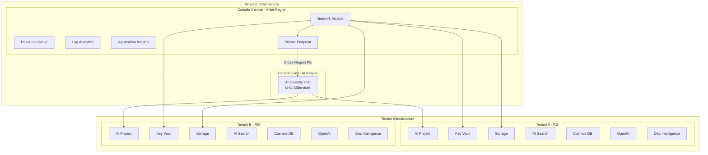
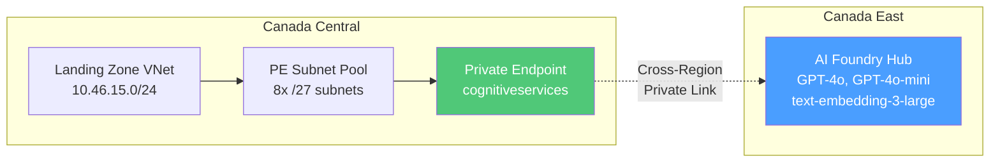
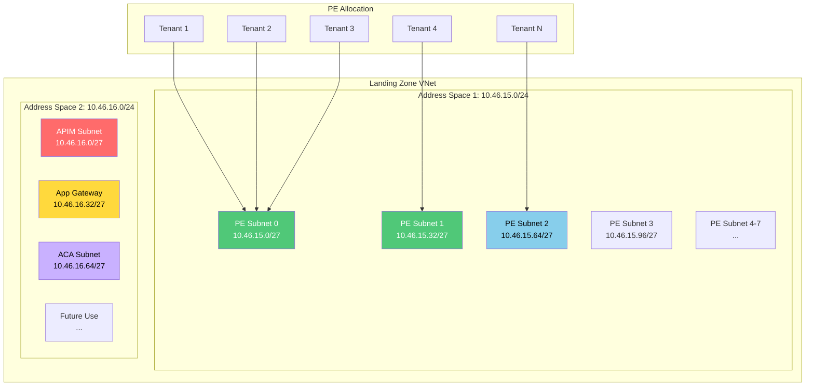
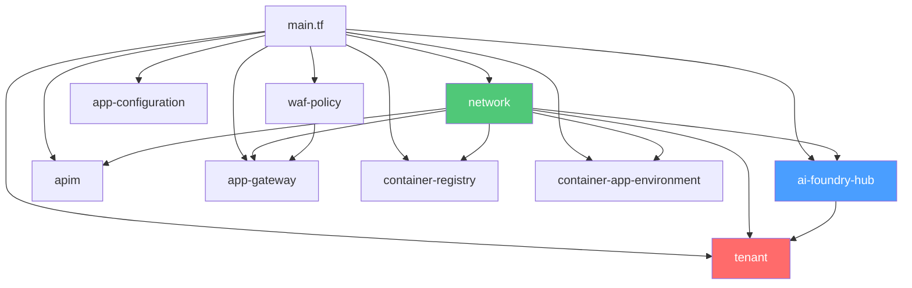
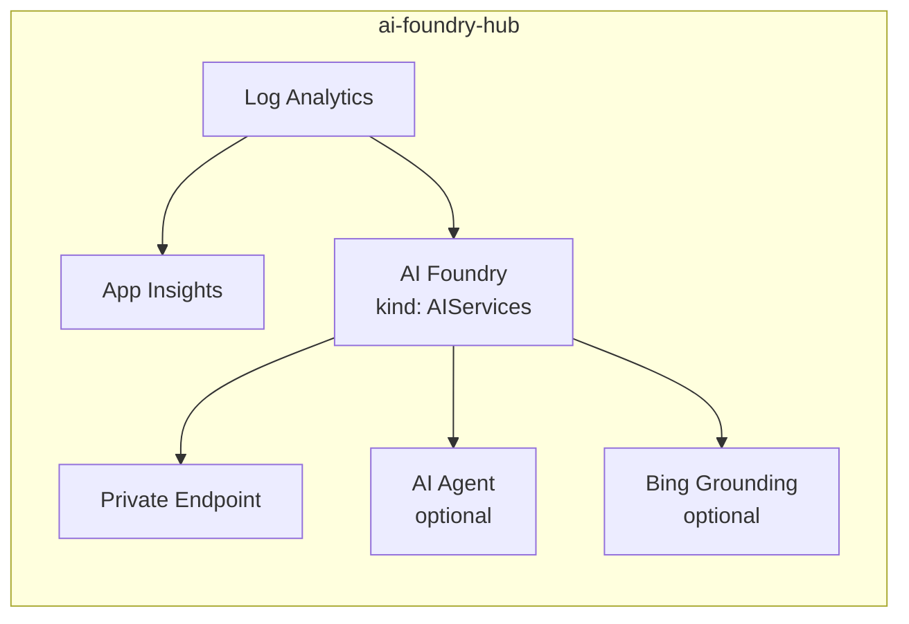
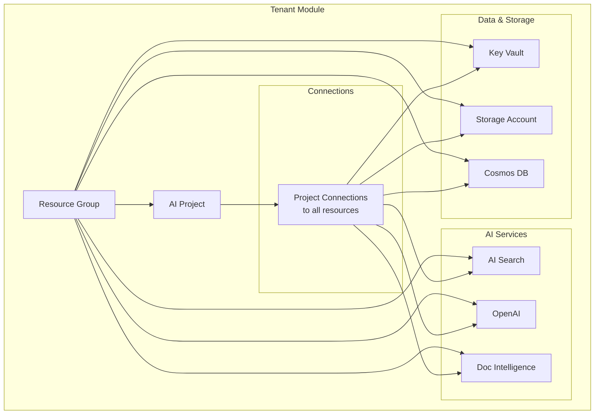
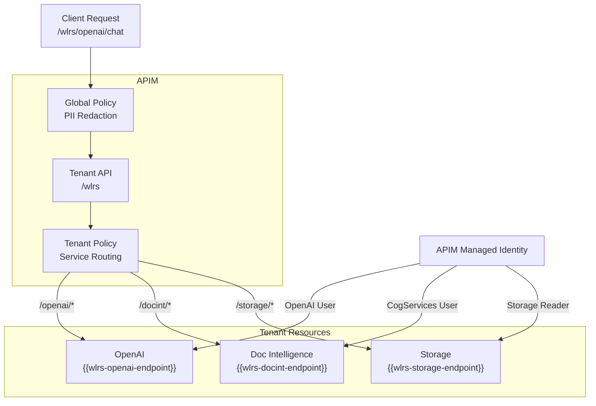
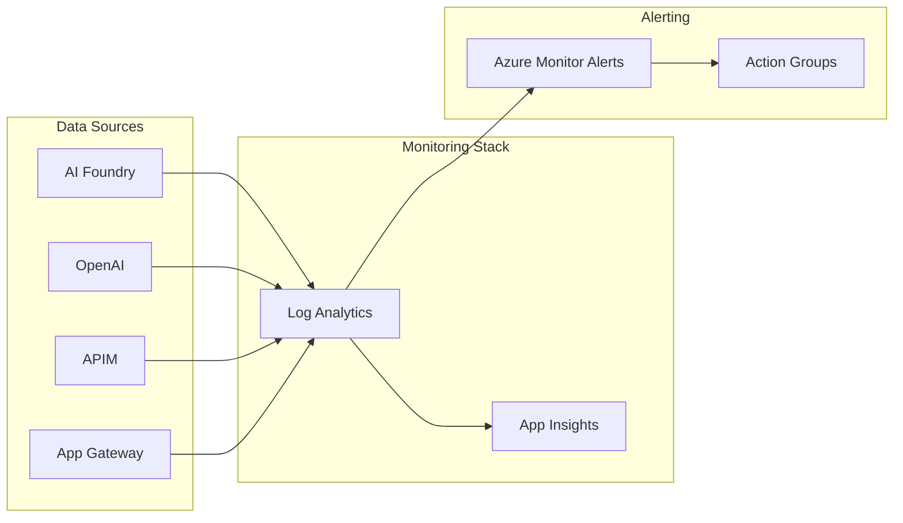
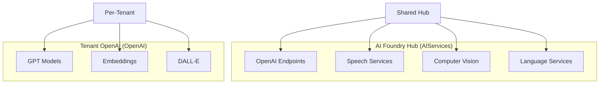

# AI Foundry Multi-Tenant Infrastructure

Enterprise-grade Azure AI Foundry platform with full tenant isolation, private networking, and cross-region model deployment.

## Table of Contents

- [Architecture Overview](#architecture-overview)
- [Cross-Region Deployment](#cross-region-deployment)
- [Network Architecture](#network-architecture)
- [Module Reference](#module-reference)
- [Tenant Configuration](#tenant-configuration)
- [Operations Runbook](#operations-runbook)
- [Troubleshooting](#troubleshooting)

---

## Architecture Overview

This infrastructure deploys a multi-tenant AI platform on Azure with the following design principles:

- **Tenant Isolation**: Each tenant gets dedicated resources in a separate resource group
- **Private Networking**: All PaaS services use private endpoints within an Azure Landing Zone
- **Cross-Region AI**: AI Foundry Hub deployed to regions with model availability (e.g., Canada East)
- **Cost Attribution**: Per-tenant resource groups enable accurate cost tracking
- **Policy-Managed DNS**: Integrates with Azure Landing Zone policy-managed private DNS zones



### Component Summary

| Component | Purpose | Location |
|-----------|---------|----------|
| AI Foundry Hub | Shared AI Services account with OpenAI endpoints | Canada East |
| AI Projects | Per-tenant project within the Hub | Linked to Hub |
| Log Analytics | Centralized logging and diagnostics | Canada Central |
| Application Insights | APM and tracing for AI applications | Canada Central |
| Private Endpoints | Secure connectivity to all PaaS services | Canada Central |

---

## Cross-Region Deployment

Azure OpenAI models have varying regional availability. This infrastructure supports deploying AI services to a different region than the VNet for model access.



### Configuration

```hcl
module "ai_foundry_hub" {
  source = "./modules/ai-foundry-hub"
  
  name     = "ai-hub-prod"
  location = "canadacentral"  # VNet and PE location
  ai_location = "canadaeast"  # AI Foundry Hub location (for models)
  
  # ... other configuration
}
```

### Available Models by Region

| Model | Canada Central | Canada East |
|-------|----------------|-------------|
| GPT-4o | ❌ | ✅ |
| GPT-4o-mini | ❌ | ✅ |
| text-embedding-3-large | ❌ | ✅ |
| GPT-4 Turbo | ✅ | ✅ |

---

## Network Architecture

The network module creates a scalable subnet architecture that supports tenant growth.



### Subnet Allocation Strategy

| # of /24s | PE Pool | APIM | AppGW | ACA |
|-----------|---------|------|-------|-----|
| 1 | .0/27 | .32/27 | .64/27 | .96/27 |
| 2 | 1st /24 (8x/27) | 2nd .0/27 | 2nd .32/27 | 2nd .64/27 |
| 4+ | 1st+2nd (16x/27) | 3rd .0/27 | 4th .0/27 | 4th .32/27 |

### PE Subnet Pool

Each /27 subnet provides ~27 usable IPs (5 reserved by Azure). With 10 private endpoints per tenant average:

| Environment | Address Spaces | PE Subnets | Max Tenants |
|-------------|---------------|------------|-------------|
| Test | 2 x /24 | 8 | ~20 |
| Prod | 4 x /24 | 16 | ~40+ |

---

## Module Reference

### Module Dependency Graph



---

### 1. Network Module

**Path**: `modules/network`

Creates subnet infrastructure with NSGs for the Landing Zone VNet.

#### Inputs

| Name | Type | Required | Description |
|------|------|----------|-------------|
| `name_prefix` | string | ✅ | Prefix for resource names |
| `vnet_name` | string | ✅ | Existing VNet name |
| `vnet_resource_group_name` | string | ✅ | VNet resource group |
| `target_vnet_address_spaces` | list(string) | ✅ | VNet address spaces |
| `source_vnet_address_space` | string | ✅ | Source VNet CIDR for NSG rules |
| `apim_subnet` | object | ❌ | APIM subnet config |
| `appgw_subnet` | object | ❌ | App Gateway subnet config |
| `aca_subnet` | object | ❌ | Container Apps subnet config |

#### Outputs

| Name | Description |
|------|-------------|
| `private_endpoint_subnet_id` | Primary PE subnet ID |
| `private_endpoint_subnet_pool` | Map of all PE subnets |
| `apim_subnet_id` | APIM subnet ID |
| `appgw_subnet_id` | App Gateway subnet ID |
| `aca_subnet_id` | ACA subnet ID |
| `vnet_id` | VNet resource ID |

---

### 2. AI Foundry Hub Module

**Path**: `modules/ai-foundry-hub`

Shared AI Foundry account with cross-region support, Application Insights, and optional AI Agent.



#### Inputs

| Name | Type | Required | Description |
|------|------|----------|-------------|
| `name` | string | ✅ | AI Foundry account name |
| `location` | string | ✅ | Region for PE and monitoring |
| `ai_location` | string | ❌ | Region for AI Foundry (defaults to location) |
| `resource_group_name` | string | ✅ | Resource group name |
| `resource_group_id` | string | ✅ | Resource group ID |
| `private_endpoint_subnet_id` | string | ✅ | PE subnet ID |
| `log_analytics` | object | ❌ | Log Analytics config |
| `application_insights` | object | ❌ | Application Insights config |
| `ai_agent` | object | ❌ | AI Agent service config |
| `bing_grounding` | object | ❌ | Bing Web Search config |

#### Outputs

| Name | Description |
|------|-------------|
| `id` | AI Foundry resource ID |
| `endpoint` | AI Foundry endpoint URL |
| `principal_id` | Managed identity principal ID |
| `ai_location` | Actual AI Foundry region |
| `log_analytics_workspace_id` | Log Analytics workspace ID |
| `application_insights_id` | Application Insights ID |
| `application_insights_connection_string` | App Insights connection string |

---

### 3. Tenant Module

**Path**: `modules/tenant`

Per-tenant resources with full isolation and project connections. Supports importing existing resources via `terraform import`.



#### Inputs

| Name | Type | Required | Description |
|------|------|----------|-------------|
| `tenant_name` | string | ✅ | Unique tenant identifier |
| `display_name` | string | ✅ | Human-readable name |
| `ai_foundry_hub_id` | string | ✅ | Parent Hub resource ID |
| `private_endpoint_subnet_id` | string | ✅ | PE subnet for tenant |
| `key_vault` | object | ❌ | Key Vault configuration |
| `storage_account` | object | ❌ | Storage configuration |
| `ai_search` | object | ❌ | AI Search configuration |
| `cosmos_db` | object | ❌ | Cosmos DB configuration |
| `openai` | object | ❌ | OpenAI configuration |
| `document_intelligence` | object | ❌ | Document Intelligence config |
| `project_connections` | object | ❌ | Auto-create project connections |
| `role_assignments` | map | ❌ | Custom RBAC assignments |

#### Outputs

| Name | Description |
|------|-------------|
| `resource_group_id` | Tenant RG resource ID |
| `project_id` | AI Project resource ID |
| `key_vault_id` | Key Vault resource ID |
| `storage_account_id` | Storage account ID |
| `openai_endpoint` | OpenAI endpoint URL |

---

### 4. APIM Module

**Path**: `modules/apim`

API Management for exposing AI services with per-tenant products and path-based routing.

#### Inputs

| Name | Type | Required | Description |
|------|------|----------|-------------|
| `name` | string | ✅ | APIM instance name |
| `sku_name` | string | ❌ | APIM SKU (default: StandardV2_1) |
| `tenant_products` | map | ❌ | Per-tenant products |
| `apis` | map | ❌ | Per-tenant API definitions with path routing |
| `named_values` | map | ❌ | Named values (created as separate resources) |
| `global_policy_xml` | string | ❌ | Global policy with PII redaction |
| `enable_private_endpoint` | bool | ❌ | Enable private endpoint (stv2) |
| `private_endpoint_subnet_id` | string | ❌ | PE subnet for APIM (stv2 only) |

#### Tenant Routing Architecture

Each tenant gets:
1. **Product** - Subscription container for tenant APIs
2. **API** - Path `/{tenant-name}` with wildcard operations `/{service}/{*path}`
3. **Named Values** - Endpoints for tenant services (`{tenant}-openai-endpoint`, `{tenant}-docint-endpoint`, `{tenant}-storage-endpoint`)
4. **Policy** - Custom XML routing policies per tenant (loaded from `params/apim/tenants/{tenant}/api_policy.xml`)
5. **RBAC** - APIM managed identity granted access to tenant resources



#### Global Policy

**File**: `params/apim/global_policy.xml`

Applied to all APIs:
- **PII Redaction**: Detects and masks SSN, credit cards, emails, phone numbers in request/response

#### Tenant-Specific Policies

**File**: `params/apim/tenants/{tenant}/api_policy.xml`

Example for tenant `wlrs-water-form-assistant`:
```xml
<when condition="@(...openai...)">
  <set-backend-service base-url="{{wlrs-openai-endpoint}}" />
  <authentication-managed-identity resource="https://cognitiveservices.azure.com" />
</when>
```

#### Validation Checks

Two plan-time validation checks ensure configuration consistency:

1. **Tenant Policy Name Mismatch** - X-Tenant-Id header in policy must match folder name
2. **Policy Missing Services** - Policy cannot reference services that are disabled (e.g., `{{wlrs-openai-endpoint}}` when openai is disabled)

---

### 5. App Gateway Module

**Path**: `modules/app-gateway`

Application Gateway v2 with WAF, SSL termination, and path-based routing.

#### Inputs

| Name | Type | Required | Description |
|------|------|----------|-------------|
| `name` | string | ✅ | App Gateway name |
| `subnet_id` | string | ✅ | App Gateway subnet |
| `sku_name` | string | ❌ | SKU (default: WAF_v2) |
| `ssl_certificates` | map | ❌ | SSL certificates from Key Vault |
| `backend_pools` | map | ❌ | Backend address pools |
| `url_path_map_configurations` | map | ❌ | URL path routing |
| `rewrite_rule_set` | map | ❌ | Header rewrite rules |
| `waf_policy_id` | string | ❌ | WAF policy reference |

---

### 6. WAF Policy Module

**Path**: `modules/waf-policy`

Dedicated WAF policy with managed and custom rules.

#### Inputs

| Name | Type | Required | Description |
|------|------|----------|-------------|
| `name` | string | ✅ | WAF policy name |
| `mode` | string | ❌ | Prevention or Detection |
| `managed_rule_sets` | list | ❌ | OWASP, Bot Manager rules |
| `custom_rules` | list | ❌ | Custom WAF rules |
| `exclusions` | list | ❌ | Rule exclusions |

---

### 7. Container Registry Module

**Path**: `modules/container-registry`

Shared ACR with optional private endpoints.

#### Inputs

| Name | Type | Required | Description |
|------|------|----------|-------------|
| `name` | string | ✅ | ACR name (alphanumeric only) |
| `sku` | string | ❌ | Basic, Standard, Premium |
| `public_network_access_enabled` | bool | ❌ | Public access (default: true) |
| `private_endpoint_subnet_id` | string | ❌ | PE subnet (if private) |

---

### 8. Container App Environment Module

**Path**: `modules/container-app-environment`

ACA environment with VNet integration for serverless containers.

#### Inputs

| Name | Type | Required | Description |
|------|------|----------|-------------|
| `name` | string | ✅ | CAE name |
| `infrastructure_subnet_id` | string | ✅ | ACA subnet (/27 min) |
| `zone_redundancy_enabled` | bool | ❌ | Zone redundancy (needs /23+) |
| `internal_load_balancer_enabled` | bool | ❌ | Private-only access |
| `log_analytics_workspace_id` | string | ❌ | Log Analytics for logs |

---

### 9. App Configuration Module

**Path**: `modules/app-configuration`

Feature flags and configuration management.

#### Inputs

| Name | Type | Required | Description |
|------|------|----------|-------------|
| `name` | string | ✅ | App Configuration name |
| `sku` | string | ❌ | free or standard |
| `feature_flags` | map | ❌ | Feature flag definitions |
| `configuration_keys` | map | ❌ | Config key-value pairs |
| `key_vault_references` | map | ❌ | Key Vault secret refs |

---

## Tenant Configuration

### Overview

All tenants are configured in a single `tenants.tfvars` file per environment using HCL format. This consolidates configuration and makes it easy to manage multiple tenants:

- `params/dev/tenants.tfvars` - development environment
- `params/test/tenants.tfvars` - testing environment
- `params/prod/tenants.tfvars` - production environment

Each file contains a map of tenant configurations that are deployed together.

### Adding a New Tenant

To add a new tenant, add an entry to the `tenants` map in the appropriate `tenants.tfvars` file:

```hcl
tenants = {
  # ... existing tenants ...
  
  contoso-platform = {
    tenant_name  = "contoso-platform"
    display_name = "Contoso AI Platform"
    enabled      = true
    
    tags = {
      ministry    = "CONTOSO"
      environment = "test"
      costCenter  = "CC-12345"
      owner       = "platform-team"
    }
    
    key_vault = {
      enabled                    = true
      sku                        = "standard"
      purge_protection_enabled   = true
      soft_delete_retention_days = 30
    }
    
    storage_account = {
      enabled                  = true
      account_tier             = "Standard"
      account_replication_type = "LRS"
      account_kind             = "StorageV2"
      access_tier              = "Hot"
    }
    
    ai_search = {
      enabled            = true
      sku                = "basic"
      replica_count      = 1
      partition_count    = 1
      semantic_search    = "free"
      local_auth_enabled = true
    }
    
    cosmos_db = {
      enabled                      = true
      offer_type                   = "Standard"
      kind                         = "GlobalDocumentDB"
      consistency_level            = "Session"
      max_interval_in_seconds      = 5
      max_staleness_prefix         = 100
      geo_redundant_backup_enabled = false
      automatic_failover_enabled   = false
    }
    
    openai = {
      enabled = true
      model_deployments = [
        {
          name              = "gpt-4o"
          model_name        = "gpt-4o"
          model_version     = "2024-11-20"
          capacity          = 10
          rai_policy_name   = "default"
        },
        {
          name          = "embedding"
          model_name    = "text-embedding-3-large"
          model_version = "1"
          capacity      = 50
        }
      ]
    }
    
    document_intelligence = {
      enabled = true
      sku     = "S0"
    }

    log_analytics = {
      enabled        = true
      retention_days = 30
      sku            = "PerGB2018"
    }
    
    content_safety = {
      pii_redaction_enabled = true
    }
  }
}
```

### Deploying Changes

After updating `tenants.tfvars`, deploy using one of these methods:

**Option 1: Direct terraform commands**
```bash
cd infra-ai-hub
terraform plan -var-file="params/test/shared.tfvars" -var-file="params/test/tenants.tfvars"
terraform apply -var-file="params/test/shared.tfvars" -var-file="params/test/tenants.tfvars"
```

**Option 2: Deployment script**
```bash
cd initial-setup/infra
./deploy-terraform.sh plan test
./deploy-terraform.sh apply test
```

### Resource Toggle Matrix

Each tenant can independently enable or disable services by setting the `enabled` flag:

| Resource | Config Key | Default | Notes |
|----------|-----------|---------|-------|
| Key Vault | `key_vault.enabled` | false | Secrets storage |
| Storage | `storage_account.enabled` | true | Blob/file storage |
| AI Search | `ai_search.enabled` | false | Vector search |
| Cosmos DB | `cosmos_db.enabled` | false | Document database |
| OpenAI | `openai.enabled` | false | LLM endpoints |
| Doc Intel | `document_intelligence.enabled` | false | Document parsing |
| Tenant Log Analytics | `log_analytics.enabled` | false | Per-tenant LAW + diagnostics |
| Content Safety | `content_safety.*` | PII: true | PII redaction |

### Tenant Log Analytics Configuration

Create a per-tenant Log Analytics workspace and attach diagnostics to enabled tenant resources (per-service diagnostics block):

```hcl
log_analytics = {
  enabled        = true
  retention_days = 30
  sku            = "PerGB2018"
}

key_vault = {
  enabled = true
  diagnostics = {
    log_groups        = ["allLogs"]
    log_categories    = []
    metric_categories = ["AllMetrics"]
  }
}
```

When enabled and the per-service `diagnostics` block is present, diagnostics are sent for:
- Key Vault
- Storage Account
- AI Search
- Cosmos DB

### Content Safety Configuration

Control PII redaction on a per-tenant basis:

```hcl
content_safety = {
  pii_redaction_enabled = true      # Enable/disable PII masking
}
```

These settings are applied at **deploy time** to the global policy:
- When enabled, the global policy redacts PII in requests/responses
- When disabled, the global policy skips PII redaction for that tenant
- Configuration in `params/{env}/tenants.tfvars` controls behavior independently per tenant


### APIM Authentication Configuration

Each tenant can be configured with one of two authentication modes:

| Mode | Config Value | Use Case |
|------|-------------|----------|
| Subscription Key | `apim_auth.mode = "subscription_key"` | Simple API key, quick setup |
| OAuth 2.0 / Azure AD | `apim_auth.mode = "oauth2"` | Enterprise, short-lived tokens |

#### Key Storage Warning ⚠️

```hcl
apim_auth = {
  mode              = "subscription_key"
  store_in_keyvault = false  # DEFAULT - recommended!
}
```

**Why `store_in_keyvault = false` is the default:**
- Many organizations have Key Vault policies that auto-rotate secrets every 90 days
- If APIM keys are stored in Key Vault, auto-rotation generates a NEW random value
- This breaks all client apps since the rotated value doesn't match the actual APIM key
- APIM subscription keys should be rotated **in APIM**, not in Key Vault

#### Subscription Key Mode (Default) - Recommended Workflow

```hcl
apim_auth = {
  mode              = "subscription_key"
  store_in_keyvault = false  # Avoid auto-rotation issues
}
```

**Key Distribution Process (Admin-Assisted):**

```
┌─────────────────────────────────────────────────────────────────────┐
│ 1. Platform Team deploys infrastructure                             │
│    terraform apply                                                  │
│                                                                     │
│ 2. Platform Team retrieves keys from Azure Portal:                  │
│    Azure Portal → APIM → Subscriptions → {tenant}-subscription     │
│    → Show Keys → Copy Primary Key                                  │
│                                                                     │
│ 3. Platform Team shares key securely with Tenant Team:              │
│    - Use secure channel (encrypted email, Teams DM, etc.)          │
│    - Or store in team's existing secrets management system          │
│                                                                     │
│ 4. Tenant Team configures their application:                        │
│    - Store key in their app's Key Vault or config                  │
│    - Use in requests via Ocp-Apim-Subscription-Key header          │
└─────────────────────────────────────────────────────────────────────┘
```

**Client usage:**
```bash
curl -X POST https://api.example.com/wlrs/openai/v1/chat/completions \
  -H "Ocp-Apim-Subscription-Key: abc123xyz789..." \
  -H "Content-Type: application/json"
```

**Key Rotation Process:**
1. Platform team regenerates key in Azure Portal (APIM → Subscriptions → Regenerate)
2. Platform team shares new key with tenant team
3. Tenant team updates their app configuration

**Terraform output (for automation):**
```bash
terraform output -json apim_tenant_subscriptions
```

#### OAuth 2.0 Mode

```hcl
apim_auth = {
  mode              = "oauth2"
  store_in_keyvault = false  # Avoid auto-rotation issues
  oauth2 = {
    secret_expiry_hours = 8760  # 1 year (optional)
  }
}
```

**Client usage:**
```python
from azure.identity import ClientSecretCredential

credential = ClientSecretCredential(
    tenant_id="...",
    client_id="...",      # From platform team
    client_secret="..."   # From platform team
)
token = credential.get_token("api://ai-hub-api/.default")

requests.post(
    "https://api.example.com/wlrs/openai/v1/chat/completions",
    headers={"Authorization": f"Bearer {token.token}"}
)
```

**Get credentials:**
```bash
terraform output -json apim_tenant_oauth2_secrets
```

**Summary of auth configuration:**
```bash
terraform output apim_tenant_auth_summary
```

#### Switching Auth Modes

To migrate from subscription key to OAuth2:

1. Update tenant config:
```hcl
apim_auth = {
  mode = "oauth2"  # Changed from "subscription_key"
}
```

2. Run `terraform apply` - creates Azure AD app registration
3. Update client applications to use OAuth2 flow
4. Old subscription key is deleted automatically

---

## Operations Runbook

### Adding a New Tenant to Deployment

Each tenant is configured individually in a dedicated folder. Follow these steps:

#### 1. Create Tenant Configuration File

Create a new tenant directory and configuration file:

```bash
mkdir -p params/test/tenants/my-new-tenant
touch params/test/tenants/my-new-tenant/tenant.tfvars
```

Edit `params/test/tenants/my-new-tenant/tenant.tfvars` with tenant-specific settings:

```hcl
tenant = {
  tenant_name  = "my-new-tenant"
  display_name = "My New Tenant"
  enabled      = true
  
  tags = {
    ministry    = "MY_MINISTRY"
    environment = "test"
    costCenter  = "CC-12345"
    owner       = "platform-team"
  }
  
  key_vault = { enabled = true, sku = "standard" }
  storage_account = { enabled = true, account_tier = "Standard" }
  ai_search = { enabled = false }
  cosmos_db = { enabled = false }
  openai = { enabled = true, model_deployments = [...] }
  document_intelligence = { enabled = true }
}
```

Refer to `params/test/tenants/README.md` for complete configuration options.

#### 2. Create APIM Policy File (Optional)

If enabling APIM for the tenant, create routing policies:

```bash
mkdir -p params/apim/tenants/my-new-tenant
touch params/apim/tenants/my-new-tenant/api_policy.xml
```

Edit `params/apim/tenants/my-new-tenant/api_policy.xml` with service routing:

```xml
<policies>
  <inbound>
    <set-header name="X-Tenant-Id" exists-action="override">
      <value>my-new-tenant</value>
    </set-header>
    
    <choose>
      <when condition="@(context.Request.Url.Path.StartsWith(&quot;/my-new-tenant/openai&quot;))">
        <set-backend-service base-url="{{my-new-tenant-openai-endpoint}}" />
        <authentication-managed-identity resource="https://cognitiveservices.azure.com" />
      </when>
      <when condition="@(context.Request.Url.Path.StartsWith(&quot;/my-new-tenant/docint&quot;))">
        <set-backend-service base-url="{{my-new-tenant-docint-endpoint}}" />
        <authentication-managed-identity resource="https://cognitiveservices.azure.com" />
      </when>
    </choose>
  </inbound>
</policies>
```

#### 3. Deploy with Phased Strategy

Deploy the tenant using the multi-phase approach:

```bash
./scripts/deploy-terraform.sh apply-phased test
```

#### 4. Verify Deployment

After apply, verify in Azure Portal:
- Azure Portal → Resource Groups → `my-new-tenant-rg`
- APIM → Products → my-new-tenant (if APIM enabled)
- APIM → APIs → my-new-tenant (if APIM enabled)
- APIM → Named Values → my-new-tenant-*-endpoint (if APIM enabled)

### Deployment Best Practices

#### Phase Strategy for foundry_project

The foundry_project module requires sequential deployment due to ETag conflicts on Azure's Cognitive Services API:

**Key Steps**:
1. Phase 1: Deploy all modules except foundry_project (parallelism=10)
2. Phase 2: Deploy foundry_project only (parallelism=1) - resolves ETag conflicts
3. Phase 3: Final apply to catch any drift (parallelism=10)

**Automation**: Use `./scripts/deploy-terraform.sh apply-phased test` for full automated phasing.

### APIM Tenant Configuration

When a tenant has APIM enabled, verify routing and policies:

#### Validation Checks (Run at Plan Time)

Two validation checks ensure configuration consistency:
- ✅ Policy file X-Tenant-Id matches folder name
- ✅ All referenced services have `enabled = true` in tenant.tfvars
- ✅ No undefined named values in policy

If validation fails, plan output identifies the exact issue.

#### Review APIM Resources

After apply, verify in Azure Portal:
- APIM → Products → {tenant-name}
- APIM → APIs → {tenant-name}
- APIM → Named Values → {tenant-name}-*-endpoint

### Updating APIM Global Policy

Edit `params/apim/global_policy.xml` to modify:
- PII redaction patterns
- Rate limiting
- Authentication

Changes apply to **all** APIs immediately on next apply.

### Monitoring APIM

**Gateway Logs (KQL)**:
```kusto
ApiManagementGatewayLogs
| where TimeGenerated > ago(1h)
| where Url contains 'wlrs' or Url contains 'sdpr'
| summarize RequestCount=count() by bin(TimeGenerated, 5m), tostring(split(Url, '/')[3])
| render timechart
```

**Tenant Request Summary**:
```kusto
ApiManagementGatewayLogs
| where TimeGenerated > ago(24h)
| summarize 
    TotalRequests=count(),
    SuccessCount=sumif(1, ResponseCode < 400),
    ErrorCount=sumif(1, ResponseCode >= 400),
    AvgLatency=avg(Duration)
  by tostring(split(Url, '/')[3])
| sort by TotalRequests desc
```

**Policy Errors**:
```kusto
ApiManagementGatewayLogs
| where ResponseCode >= 400
| where TimeGenerated > ago(1h)
| project TimeGenerated, Url, ResponseCode, Message, Latency=Duration
| order by TimeGenerated desc
| take 50
```

---

### Monitoring Architecture



### Key Metrics to Monitor

| Resource | Metric | Threshold |
|----------|--------|-----------|
| OpenAI | Token usage | 80% of quota |
| OpenAI | Latency (p99) | > 5s |
| AI Search | Query latency | > 500ms |
| APIM | Failed requests | > 5% |
| App Gateway | Unhealthy hosts | > 0 |
| Cosmos DB | RU consumption | > 80% |

### Scaling Tenants

**Adding capacity to a tenant:**

1. Update the tenant configuration in `params/{env}/tenants.tfvars`
2. Increase SKU or capacity values
3. Run `terraform apply`

**Moving tenant to dedicated PE subnet:**

1. Update `private_endpoint_subnet_id` in tenant config
2. Resources will be recreated with new PE

### Backup & Recovery

| Resource | Backup Method | RTO |
|----------|---------------|-----|
| Key Vault | Soft delete + purge protection | Immediate |
| Storage | Blob versioning + soft delete | Minutes |
| Cosmos DB | Continuous backup | Point-in-time |
| AI Search | No built-in (use index snapshots) | Hours |

---

## Troubleshooting

### Common Issues

#### 1. Foundry Project ETag Conflicts

**Symptom**: `Error creating AI Project: ETags do not match` when deploying foundry_project

**Cause**: Concurrent foundry_project creation triggers Azure service conflicts

**Solution**: Use Phase 2 with `parallelism=1`:
```bash
terraform apply -parallelism=1 -target='module.foundry_project' \
  -var-file="params/test/shared.tfvars" \
  -var-file="params/test/tenants.tfvars"
```

**Automation**: Use `./scripts/deploy-terraform.sh apply-phased test` (handles phasing automatically)

#### 2. AI Foundry Service Soft Delete

**Symptom**: `Cannot create AI Foundry: Account already exists` after recent destroy

**Cause**: Azure Cognitive Services has 48-hour soft-delete period

**Solution**: Purge the soft-deleted account:
```bash
az cognitiveservices account purge \
  --name ai-services-hub-test-foundry \
  --resource-group ai-services-hub-test \
  --location "canadaeast"
```

**Automation**: Add to cleanup workflow or wait 48 hours before redeploying

#### 3. Private Endpoint DNS Not Resolving

**Symptom**: Resources created but connectivity fails

**Cause**: Azure Policy hasn't created DNS zone group yet

**Solution**: Wait for policy propagation (up to 10 minutes) or check:

```bash
az network private-endpoint dns-zone-group list \
  --resource-group <rg> \
  --endpoint-name <pe-name>
```

#### 4. Cross-Region PE Connectivity

**Symptom**: Cannot reach Canada East AI Foundry from Canada Central VNet

**Cause**: Private DNS zone not linked to VNet

**Solution**: Verify DNS zone link exists:

```bash
az network private-dns link vnet list \
  --resource-group <dns-zone-rg> \
  --zone-name privatelink.cognitiveservices.azure.com
```

#### 5. OpenAI Model Deployment Fails

**Symptom**: Model deployment returns capacity error

**Cause**: Insufficient quota in region

**Solution**: 
1. Check quota: Azure Portal → OpenAI → Quotas
2. Request increase or reduce capacity
3. Try different region if available

#### 6. Terraform State Drift

**Symptom**: Tags keep showing as changed

**Cause**: Azure Policy adds tags after creation

**Solution**: Already handled via `lifecycle { ignore_changes = [tags] }`

#### 7. Storage Account Already Exists

**Symptom**: Storage account creation fails because it already exists in Azure

**Cause**: Resource was created outside of Terraform (manual deployment, prior test, etc.)

**Solution**: Import the existing resource into Terraform state:

```bash
terraform import \
  -var-file="params/test/shared.tfvars" \
  -var-file="params/test/tenants.tfvars" \
  'module.tenant["tenant-name"].azurerm_storage_account.this[0]' \
  '/subscriptions/{sub-id}/resourceGroups/{rg}/providers/Microsoft.Storage/storageAccounts/{account-name}'
```


#### 8. Terraform State Lock

**Symptom**: `Error acquiring the state lock: Bad Request` or operations hang

**Cause**: Previous deployment crashed and left state lock file

**Solution**: Force unlock (use with caution on active deployments):

```bash
terraform force-unlock -force {lock-id}
```

**Verification**: Check lock status before applying:
```bash
az storage blob metadata show \
  --container-name tfstate \
  --name "ai-services-hub/test/terraform.tfstate" \
  --account-name tftestaihubtracking \
  --query "metadata"
```

### Diagnostic Queries

**Check AI Foundry requests (KQL):**

```kusto
AzureDiagnostics
| where ResourceProvider == "MICROSOFT.COGNITIVESERVICES"
| where Category == "RequestResponse"
| project TimeGenerated, OperationName, DurationMs, ResultType
| order by TimeGenerated desc
| take 100
```

**Check APIM errors (KQL):**

```kusto
ApiManagementGatewayLogs
| where ResponseCode >= 400
| summarize count() by bin(TimeGenerated, 1h), ResponseCode
| render timechart
```

---

## Folder Structure

```
infra-ai-hub/
├── main.tf                    # Orchestration layer
├── variables.tf               # Core variables
├── outputs.tf                 # Module outputs
├── providers.tf               # Provider config
├── backend.tf                 # State backend
├── locals.tf                  # Local values & validation checks
├── terraform.tfvars           # Variable values
│
├── modules/
│   ├── network/               # Subnet infrastructure
│   ├── ai-foundry-hub/        # Shared AI Foundry
│   ├── tenant/                # Per-tenant resources
│   ├── apim/                  # API Management
│   ├── app-gateway/           # Application Gateway
│   ├── waf-policy/            # WAF rules
│   ├── container-registry/    # Shared ACR
│   ├── container-app-environment/  # ACA
│   └── app-configuration/     # Feature flags
│
├── scripts/
│   └── wait-for-dns-zone.sh   # DNS propagation wait
│
└── params/
    ├── apim/
    │   ├── global_policy.xml              # PII redaction (all APIs)
    │   ├── fragments/                     # Reusable authentication policies
    │   │   ├── cognitive-services-auth.xml  # Managed identity for OpenAI, DI, Search
    │   │   ├── storage-auth.xml             # Managed identity for Blob Storage
    │   │   ├── cosmosdb-auth.xml            # Managed identity for Cosmos DB
    │   │   └── keyvault-auth.xml            # Managed identity for Key Vault
    │   └── tenants/
    │       └── {tenant-name}/
    │           └── api_policy.xml        # Tenant-specific routing
    │
    ├── dev/
    │   ├── shared.tfvars                  # Shared config (APIM, App GW, network, monitoring)
    │   └── tenants.tfvars                 # All dev tenant configurations (map format)
    ├── test/
    │   ├── shared.tfvars
    │   └── tenants.tfvars                 # All test tenant configurations (map format)
    └── prod/
        ├── shared.tfvars
        └── tenants.tfvars                 # All prod tenant configurations (map format)
```

---

## Validated Deployment Status

✅ **Multi-Tenant Infrastructure**: Fully operational
- Network: VNet, subnets, NSGs deployed and validated
- AI Foundry Hub: Deployed with cross-region support (Canada Central→Canada East)
- Foundry Projects: Per-tenant projects created successfully
- Tenant Services: Multiple tenants (wlrs, sdpr-invoice-automation) with mixed service configurations
- APIM: Tenant-specific routing, policies, and PII redaction active

✅ **Deployment Process**: Multi-phase strategy validated
- Phase 1: All modules except foundry_project (parallelism: 10)
- Phase 2: foundry_project only (parallelism: 1) - resolves ETag conflicts
- Phase 3: Final validation apply

✅ **Resource Import**: Tested and working
- Storage account import procedure operational
- Batch import scripts available

✅ **Integration Tests**: Passing
- API Gateway logs show successful tenant requests
- Routing by tenant working correctly
- Service endpoints accessible

---

## Version Compatibility

| Component | Version | Status |
|-----------|---------|--------|
| Terraform | >= 1.12.0 | ✅ Validated |
| AzureRM Provider | >= 4.20.0 | ✅ Validated |
| AzAPI Provider | >= 2.5.0 | ✅ Validated |
| AVM APIM | 0.0.6 | ✅ Validated |
| AVM App Gateway | 0.4.3 | ✅ Validated |
| AVM Container Registry | 0.5.0 | ✅ Deployed |
| AVM Container App Env | 0.3.0 | ✅ Deployed |

---

## Azure OpenAI vs AI Foundry

Understanding the difference:

| Concept | Description |
|---------|-------------|
| **Azure OpenAI Service** | LLM API service (GPT-4o, embeddings). Uses `kind: OpenAI` |
| **Azure AI Foundry** | Orchestration platform (formerly AI Studio) with Hubs and Projects |
| **AI Foundry Hub** | Uses `kind: AIServices` which **includes** OpenAI + other AI capabilities |
| **AI Project** | Workspace within a Hub for organizing ML assets per tenant |



In this infrastructure:
- **AI Foundry Hub** = Shared, deployed to Canada East for model availability
- **Per-tenant OpenAI** = Dedicated `kind: OpenAI` accounts for isolation

---

## Local Development Deployment

This guide explains how to deploy infrastructure from your local machine to a development or test environment. This is essential for platform maintainers who need to work in parallel (e.g., one person in `dev`, another in `test`) or test changes locally before pushing to CI/CD.

### Why This Workflow Exists

**Private Endpoints Block Public Access**: This infrastructure uses private endpoints for all Azure PaaS services (Key Vault, Storage, AI services, etc.). While GitHub Actions can deploy control plane resources (creating VMs, networks, etc.) using OIDC authentication, they **cannot access the data plane** (reading secrets, uploading blobs) when private endpoints are enabled.

**Chisel Provides Network Access**: By establishing a secure tunnel through the Chisel proxy server (deployed in the VNet), your local machine can reach private endpoints as if it were inside the Azure VNet. This enables Terraform to perform data plane operations like reading Key Vault secrets during deployment.

For a detailed technical explanation, see the [Technical Deep Dive: Control vs Data Plane](../docs/technical-deep-dive.html).

---

### Prerequisites

Before starting, ensure you have:

- **Docker** installed and running on your local machine
- **Azure CLI** authenticated (`az login`)
- **Terraform** >= 1.12.0 installed
- **Chisel credentials** from the platform team or Terraform outputs
- **Appropriate Azure permissions** (Contributor or Owner on the subscription)

---

### Architecture Overview

```
Local Machine (Terraform)
        ↓
HTTP Proxy (Privoxy on localhost:8118)
        ↓
SOCKS5 Proxy (Chisel on localhost:18080)
        ↓
HTTPS Tunnel to Azure
        ↓
Chisel Server (App Service in VNet)
        ↓
Private Endpoints (Key Vault, Storage, AI Services, etc.)
```

The workflow uses two Docker containers:
1. **Chisel Client** - Creates a SOCKS5 tunnel to Azure
2. **Privoxy** - Converts the SOCKS5 proxy to HTTP/HTTPS proxy (Terraform-compatible)

---

### Step 1: Get Chisel Credentials

The Chisel proxy is deployed in the **tools subscription** (`da4cf6-tools - AI Services Hub`). Retrieve the credentials using Azure CLI:

```bash
# Switch to tools subscription
az account set --subscription "da4cf6-tools - AI Services Hub"

# Get the authentication credentials
CHISEL_AUTH=$(az webapp config appsettings list \
  --name ai-hub-tools-azure-proxy \
  --resource-group ai-hub-tools \
  --query "[?name=='CHISEL_AUTH'].value" -o tsv)

# Get the proxy URL
CHISEL_URL="https://$(az webapp show \
  --name ai-hub-tools-azure-proxy \
  --resource-group ai-hub-tools \
  --query defaultHostName -o tsv)"

# Display credentials
echo "Proxy URL: $CHISEL_URL"
echo "Auth: $CHISEL_AUTH"

# Switch back to your working subscription (e.g., dev)
az account set --subscription "da4cf6-dev - AI Services Hub"
```

**Expected output**:
```
Proxy URL: https://ai-hub-tools-azure-proxy.azurewebsites.net
Auth: username:password
```

**Alternative**: Contact the platform team if you don't have access to the tools subscription.

**Note**: Do not commit these credentials to version control.

---

### Step 2: Start Chisel Tunnel (SOCKS5 Proxy)

Open a terminal and run the Chisel client using the credentials from Step 1:

```bash
docker run --rm -it -p 18080:1080 jpillora/chisel:latest client \
  --auth "$CHISEL_AUTH" \
  $CHISEL_URL \
  0.0.0.0:1080:socks
```

**Or with credentials directly** (if you didn't set environment variables):

```bash
docker run --rm -it -p 18080:1080 jpillora/chisel:latest client \
  --auth "username:password" \
  https://ai-hub-tools-azure-proxy.azurewebsites.net \
  0.0.0.0:1080:socks
```

**Command breakdown**:
- `-p 18080:1080` - Map local port 18080 to container's SOCKS5 port 1080
- `--auth "$CHISEL_AUTH"` - Use the authentication credentials from the App Service
- `$CHISEL_URL` - The proxy URL (ai-hub-tools-azure-proxy.azurewebsites.net)
- `0.0.0.0:1080:socks` - Start SOCKS5 proxy on all interfaces

Leave this terminal running. You should see:
```
[client] Connected (Latency XXXms)
```

---

### Step 3: Build and Start Privoxy (HTTP Proxy)

Privoxy converts the SOCKS5 proxy to an HTTP/HTTPS proxy that Terraform can use.

**First time only** - Build the Privoxy image:

```bash
cd azure-proxy/privoxy
docker build -t local/privoxy-socks-bridge:latest .
```

**Start Privoxy** (in a new terminal):

```bash
docker run --rm -d --name privoxy \
  --network host \
  -e SOCKS_HOST=127.0.0.1 \
  -e SOCKS_PORT=18080 \
  local/privoxy-socks-bridge:latest
```

**Command breakdown**:
- `--network host` - Use host networking to access localhost:18080
- `-e SOCKS_HOST=127.0.0.1` - Point to Chisel SOCKS5 proxy
- `-e SOCKS_PORT=18080` - Chisel's SOCKS5 port
- `-d` - Run in detached mode

Privoxy will now be listening on `localhost:8118`.

**Verify it's running**:
```bash
docker ps | grep privoxy
```

---

### Step 4: Configure Environment Variables and terraform.tfvars

#### A. Set Environment Variables

Set up backend configuration for your target environment:

**For dev environment**:

```bash
export BACKEND_RESOURCE_GROUP="da4cf6-dev-networking"
export BACKEND_STORAGE_ACCOUNT="tfdevaihubtracking"
export ENVIRONMENT="dev"
```

**For test environment**:

```bash
export BACKEND_RESOURCE_GROUP="da4cf6-test-networking"
export BACKEND_STORAGE_ACCOUNT="tftestaihubtracking"
export ENVIRONMENT="test"
```

#### B. Configure terraform.tfvars

The `infra-ai-hub/terraform.tfvars` file contains environment-specific configuration. **This file is git-ignored** and must be obtained from another developer or configured manually.

**Location**: `infra-ai-hub/terraform.tfvars`

**Sample configuration** (replace placeholder values with actual values from your team):

```hcl
### TEST secret configs ###
# app_env             = "test"
# app_name            = "ai-services-hub"
# resource_group_name = "ai-services-hub-test"
# location            = "Canada Central"
# common_tags = {
#  environment = "test"
#  repo_name   = "ai-hub-tracking"
#  app_env     = "test"
# }
# subscription_id            = "$test_subscription_id"
# tenant_id                  = "$tenant_id"
# client_id                  = ""
# use_oidc                   = false
# vnet_name                  = "$licenseplate-test-vwan-spoke"
# vnet_resource_group_name   = "$licenseplate-test-networking"
# target_vnet_address_spaces = ["$test_address_space_1", "$test_address_space_2"]
# source_vnet_address_space  = "$source_address_space"

# DEV SECRET VARS
app_env             = "dev"
app_name            = "ai-services-hub"
resource_group_name = "ai-services-hub-dev"
location            = "Canada Central"
common_tags = {
  environment = "dev"
  repo_name   = "ai-hub-tracking"
  app_env     = "dev"
}
subscription_id            = "$dev_subscription_id"
tenant_id                  = "$tenant_id"
client_id                  = ""
use_oidc                   = false
vnet_name                  = "$licenseplate-dev-vwan-spoke"
vnet_resource_group_name   = "$licenseplate-dev-networking"
target_vnet_address_spaces = ["$dev_address_space"]
source_vnet_address_space  = "$source_address_space"
```

**Placeholder values to replace**:
- `$dev_subscription_id` - Your dev Azure subscription ID
- `$test_subscription_id` - Your test Azure subscription ID
- `$tenant_id` - Your Azure AD tenant ID
- `$licenseplate` - Your license plate (e.g., `da4cf6`)
- `$dev_address_space` - Dev VNet address space
- `$test_address_space_1` - Test VNet primary address space
- `$test_address_space_2` - Test VNet secondary address space
- `$source_address_space` - Source VNet address space

**Switching between environments**:
- **For dev**: Comment out TEST section, uncomment DEV section
- **For test**: Comment out DEV section, uncomment TEST section

**Important Notes**:
- This file is **not committed to git** (listed in `.gitignore`)
- Obtain a copy from another developer on your team with actual values
- Update the active environment by commenting/uncommenting the appropriate section
- The `subscription_id` must match the subscription you're deploying to

---

### Step 5: Preview Changes (Terraform Plan)

Run a Terraform plan to preview what changes will be made:

```bash
cd /home/alstruk/GitHub/ai-hub-tracking/infra-ai-hub && \
HTTP_PROXY="http://127.0.0.1:8118" \
HTTPS_PROXY="http://127.0.0.1:8118" \
NO_PROXY="management.azure.com,login.microsoftonline.com,graph.microsoft.com,registry.terraform.io,releases.hashicorp.com,github.com,objects.githubusercontent.com" \
CI="true" \
BACKEND_RESOURCE_GROUP="${BACKEND_RESOURCE_GROUP}" \
BACKEND_STORAGE_ACCOUNT="${BACKEND_STORAGE_ACCOUNT}" \
./scripts/deploy-terraform.sh plan ${ENVIRONMENT}
```

**Environment variables explained**:
- `HTTP_PROXY` / `HTTPS_PROXY` - Route traffic through Privoxy (which routes through Chisel)
- `NO_PROXY` - Bypass proxy for Azure control plane and Terraform registry (these are publicly accessible)
- `CI="true"` - Enables non-interactive mode in the deployment script
- `BACKEND_RESOURCE_GROUP` - Resource group containing Terraform state storage
- `BACKEND_STORAGE_ACCOUNT` - Storage account for Terraform state

---

### Step 6: Deploy Infrastructure (Terraform Apply)

Deploy using the phased strategy to avoid ETag conflicts:

```bash
cd /home/alstruk/GitHub/ai-hub-tracking/infra-ai-hub && \
HTTP_PROXY="http://127.0.0.1:8118" \
HTTPS_PROXY="http://127.0.0.1:8118" \
NO_PROXY="management.azure.com,login.microsoftonline.com,graph.microsoft.com,registry.terraform.io,releases.hashicorp.com,github.com,objects.githubusercontent.com" \
CI="true" \
BACKEND_RESOURCE_GROUP="${BACKEND_RESOURCE_GROUP}" \
BACKEND_STORAGE_ACCOUNT="${BACKEND_STORAGE_ACCOUNT}" \
./scripts/deploy-terraform.sh apply-phased ${ENVIRONMENT} --auto-approve
```

The `apply-phased` command automatically handles the three-phase deployment:
1. **Phase 1**: Deploy all modules except `foundry_project` (parallelism=10)
2. **Phase 2**: Deploy `foundry_project` modules only (parallelism=1 to avoid ETag conflicts)
3. **Phase 3**: Final validation apply to catch any drift

---

### Step 7: Run Integration Tests (Optional)

Test the deployed infrastructure using the integration test suite:

```bash
cd tests/integration

# Run all tests against your environment
TEST_ENV=${ENVIRONMENT} ./run-tests.sh

# Run a single test file
TEST_ENV=${ENVIRONMENT} ./run-tests.sh pii-redaction.bats
```

The tests validate:
- API routing through APIM
- PII redaction functionality
- Tenant isolation
- Service connectivity

---

### Step 8: Destroy Landing Zone (Cost Savings)

When you're done working, destroy the infrastructure to avoid accruing charges:

```bash
cd /home/alstruk/GitHub/ai-hub-tracking/infra-ai-hub && \
HTTP_PROXY="http://127.0.0.1:8118" \
HTTPS_PROXY="http://127.0.0.1:8118" \
NO_PROXY="management.azure.com,login.microsoftonline.com,graph.microsoft.com,registry.terraform.io,releases.hashicorp.com,github.com,objects.githubusercontent.com" \
CI="true" \
BACKEND_RESOURCE_GROUP="${BACKEND_RESOURCE_GROUP}" \
BACKEND_STORAGE_ACCOUNT="${BACKEND_STORAGE_ACCOUNT}" \
./scripts/deploy-terraform.sh destroy-phased ${ENVIRONMENT} --auto-approve
```

**Important**: The `destroy-phased` command reverses the deployment phases to cleanly remove all resources.

---

### Working with Multiple Environments

This workflow enables multiple developers to work in parallel by deploying to separate environments (dev, test, prod).

**Scenario**: Developer A works in `dev`, Developer B works in `test`

**Developer A (dev environment)**:
```bash
export BACKEND_RESOURCE_GROUP="da4cf6-dev-networking"
export BACKEND_STORAGE_ACCOUNT="tfdevaihubtracking"
export ENVIRONMENT="dev"
# ... run plan/apply commands
```

**Developer B (test environment)**:
```bash
export BACKEND_RESOURCE_GROUP="da4cf6-test-networking"
export BACKEND_STORAGE_ACCOUNT="tftestaihubtracking"
export ENVIRONMENT="test"
# ... run plan/apply commands
```

Each environment has:
- **Separate Terraform state** - Stored in different storage accounts
- **Separate Azure resources** - Deployed to different resource groups
- **Separate configuration** - Using environment-specific `params/{env}/` files

---

### Switching Terraform State Between Environments

When you need to switch from one environment to another (e.g., from `test` to `dev`), you must perform **two critical steps**:

1. **Update `terraform.tfvars`** - Switch the active environment configuration
2. **Migrate Terraform state** - Point to the new backend

#### Step 1: Update terraform.tfvars

Edit `infra-ai-hub/terraform.tfvars` and comment/uncomment the appropriate environment section as shown in [Step 4B](#step-4-configure-environment-variables-and-terraformtfvars).

**Switch from test to dev**:
- Comment out the entire TEST section (add `#` at the start of each line)
- Uncomment the entire DEV section (remove `#` from the start of each line)

**Switch from dev to test**:
- Comment out the entire DEV section
- Uncomment the entire TEST section

#### Step 2: Migrate Terraform State

After updating `terraform.tfvars`, migrate the Terraform backend:

**Switch from test to dev**:

```bash
cd /home/alstruk/GitHub/ai-hub-tracking/infra-ai-hub

BACKEND_RESOURCE_GROUP="da4cf6-dev-networking" \
BACKEND_STORAGE_ACCOUNT="tfdevaihubtracking" \
./scripts/deploy-terraform.sh init dev -migrate-state
```

**Switch from dev to test**:

```bash
cd /home/alstruk/GitHub/ai-hub-tracking/infra-ai-hub

BACKEND_RESOURCE_GROUP="da4cf6-test-networking" \
BACKEND_STORAGE_ACCOUNT="tftestaihubtracking" \
./scripts/deploy-terraform.sh init test -migrate-state
```

**What happens during migration**:
1. Terraform reads the current backend configuration from `.terraform/terraform.tfstate`
2. Connects to the **new** backend (specified by `BACKEND_RESOURCE_GROUP` and `BACKEND_STORAGE_ACCOUNT`)
3. Asks for confirmation to migrate state
4. Updates `.terraform/terraform.tfstate` to point to the new backend

**Critical**: You **must** update both `terraform.tfvars` AND run `init -migrate-state` when switching environments. If you skip either step:
- Skipping `terraform.tfvars` update → Terraform will deploy to the wrong environment
- Skipping `init -migrate-state` → Terraform will use the wrong state, leading to errors or unintended changes
