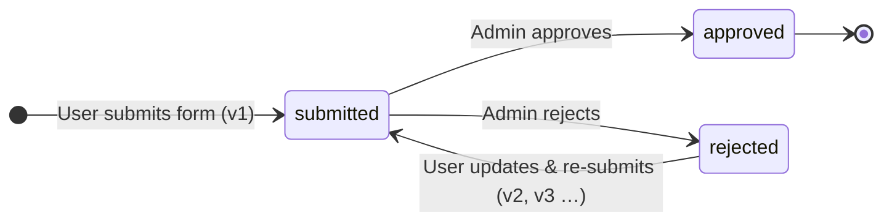
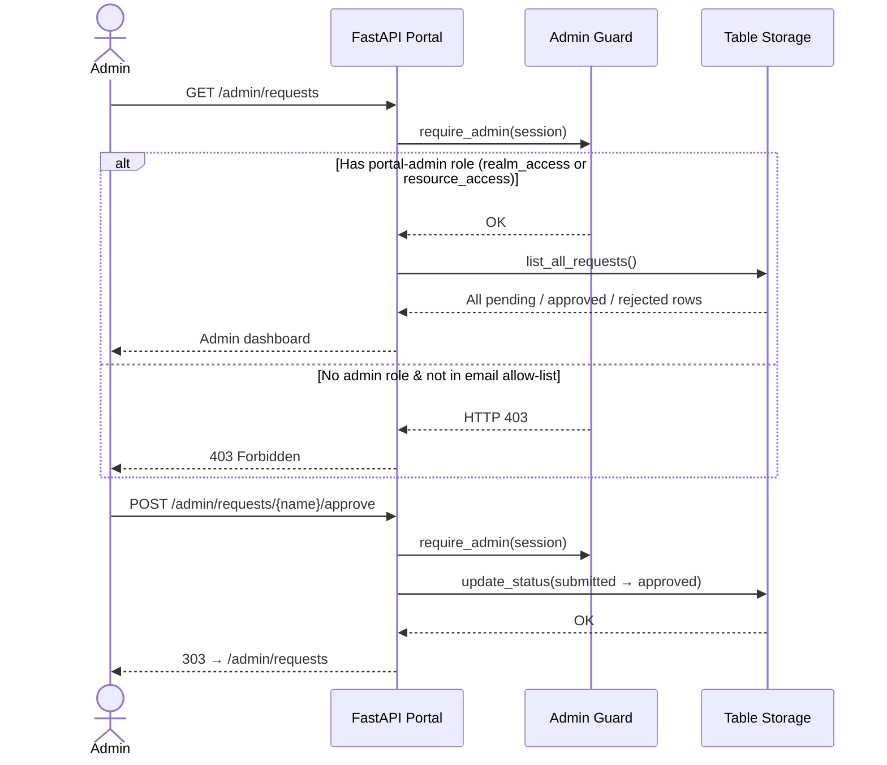
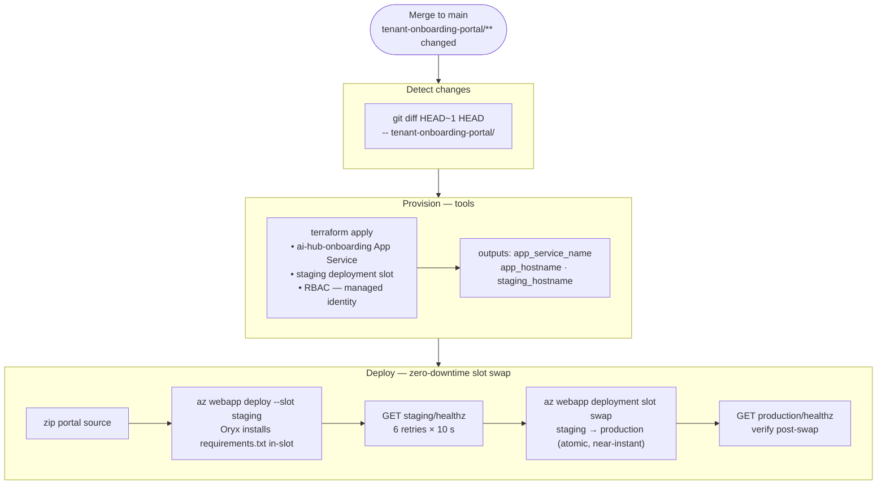
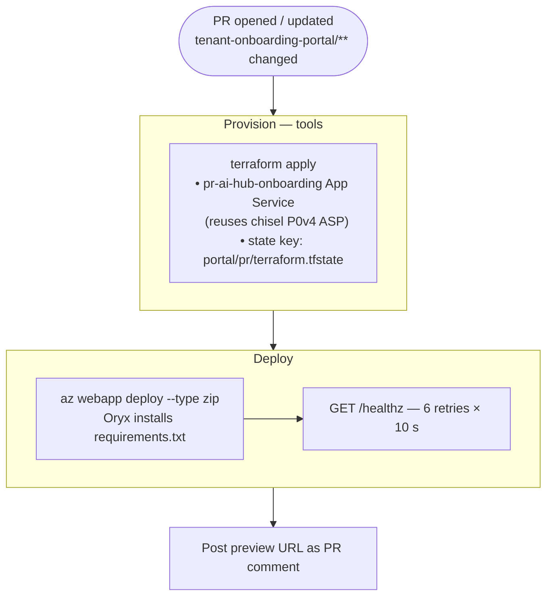
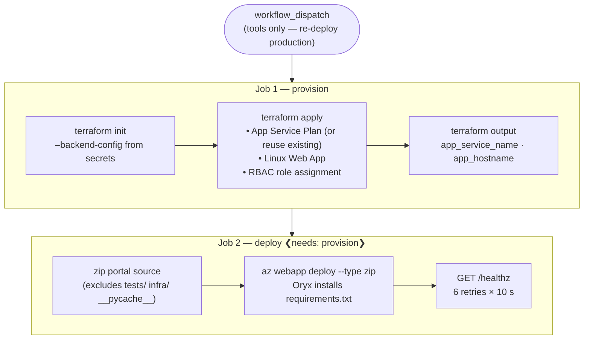

# Tenant Onboarding Portal

A FastAPI web application that lets BCGov employees authenticate via IDIR (BCGov Keycloak SSO), manage AI Services Hub tenant configurations, and submit requests for admin approval. Approved requests generate `tenant.tfvars` HCL files consumed by the `infra-ai-hub` Terraform stack.

---

## Architecture

```mermaid
flowchart LR
    subgraph Users
        U([BCGov Employee])
        A([AI Hub Admin])
    end

    subgraph Azure
        subgraph AppService [App Service – native Python]
            Portal[FastAPI Portal\nGunicorn + Uvicorn]
        end
        TS[(Azure Table Storage\nTenantRequests\nTenantRegistry)]
    end

    KC[BCGov Keycloak\nIDIR SSO]

    U  -->|1 login / submit form| Portal
    A  -->|2 approve / reject|    Portal
    Portal -->|3 auth code flow|  KC
    KC     -->|4 id_token + roles| Portal
    Portal <-->|5 read / write|   TS
```

**No Docker.** The portal runs as a native Python App Service. Azure deploys a zip, Oryx installs `requirements.txt` inside the sandbox, and Gunicorn + Uvicorn serve the ASGI app.

---

## User Flows

### OIDC Login (IDIR via BCGov Keycloak)

```mermaid
sequenceDiagram
    actor User
    participant Browser
    participant Portal as FastAPI Portal
    participant KC as BCGov Keycloak (IDIR)

    User->>Browser: Navigate to portal

    alt Production (PORTAL_OIDC_DISCOVERY_URL is set)
        Browser->>Portal: GET /auth/login
        Portal->>Browser: 302 → Keycloak /authorize
        Browser->>KC: Authorization request
        User->>KC: Authenticate with IDIR credentials
        KC->>Browser: 302 → /auth/callback?code=…
        Browser->>Portal: GET /auth/callback?code=…
        Portal->>KC: Exchange code for tokens
        KC-->>Portal: id_token + access_token
        Note over Portal: Validate aud claim in id_token<br/>(token-confusion protection)
        Note over Portal: Decode access_token JWT<br/>→ extract realm_access.roles<br/>→ extract resource_access.&lt;client&gt;.roles
        Portal->>Browser: Set signed session cookie
        Browser->>Portal: GET /tenants/ (with session)
        Portal-->>Browser: Dashboard
    else Dev mode (PORTAL_OIDC_DISCOVERY_URL is empty)
        Browser->>Portal: GET /auth/login
        Note over Portal: Synthetic session created<br/>dev@gov.bc.ca + portal-admin role
        Portal->>Browser: 302 → /tenants/
    end
```

---

### Tenant Request Submission

```mermaid
sequenceDiagram
    actor User
    participant Portal as FastAPI Portal
    participant Val as Pydantic Validator
    participant Gen as tfvars Generator
    participant Store as Table Storage

    User->>Portal: GET /tenants/new
    Portal-->>User: Blank tenant form

    User->>Portal: POST /tenants/new (form data)
    Portal->>Val: TenantFormData.from_form(data)

    alt Validation fails
        Val-->>Portal: ValidationError
        Portal-->>User: HTTP 422 – field errors
    else Validation passes
        Val-->>Portal: TenantFormData
        Portal->>Gen: generate_all_env_tfvars(data)
        Note over Gen: Generates HCL for dev / test / prod
        Gen-->>Portal: {dev: "…", test: "…", prod: "…"}
        Portal->>Store: create_request(tenant, v1, status=submitted)
        Store-->>Portal: OK
        Portal-->>User: 303 → /tenants/&lt;name&gt;
    end
```

---

### Request Lifecycle



> Each re-submission creates a new versioned row (`v2`, `v3`, …) in `TenantRequests`. Previous versions are preserved for audit purposes.

---

### Admin Approval



---


### Prerequisites

| Tool | Version | Notes |
|------|---------|-------|
| Python | ≥ 3.13 | `python --version` |
| pip / uv | any | `uv` is faster but optional |

### 1 — Create a virtual environment

```bash
cd tenant-onboarding-portal

# with uv (recommended)
uv venv .venv && source .venv/bin/activate   # macOS/Linux
uv venv .venv && .venv\Scripts\activate      # Windows

# or with plain pip
python -m venv .venv && source .venv/bin/activate   # macOS/Linux
python -m venv .venv && .venv\Scripts\activate      # Windows
```

### 2 — Install dependencies

```bash
# Runtime + dev tools (pytest, ruff)
pip install -e ".[dev]"
```

### 3 — Configure environment variables

Copy the example file and edit as needed:

```bash
cp .env.example .env
```

The minimum set for local dev (dev auto-login mode — no real Keycloak needed):

```dotenv
# .env
PORTAL_SECRET_KEY=any-string-32-chars-or-longer-here
PORTAL_OIDC_DISCOVERY_URL=          # empty → dev auto-login (no OIDC)
```

> **Dev auto-login mode**: when `PORTAL_OIDC_DISCOVERY_URL` is empty, the app skips all OIDC flows and creates a synthetic session with a test user that has the `portal-admin` role. All pages (including the admin dashboard) are accessible without a real Keycloak server.

Full variable reference:

| Variable | Default | Description |
|----------|---------|-------------|
| `PORTAL_SECRET_KEY` | `change-me-in-production` | Starlette session cookie signing key. Must be ≥ 32 random bytes in production. |
| `PORTAL_OIDC_DISCOVERY_URL` | `""` | BCGov Keycloak `.well-known/openid-configuration` URL. **Empty = dev auto-login.** |
| `PORTAL_OIDC_CLIENT_ID` | `""` | Keycloak client ID (required when OIDC is enabled). |
| `PORTAL_OIDC_CLIENT_SECRET` | `""` | Keycloak client secret (required when OIDC is enabled). |
| `PORTAL_OIDC_CLIENT_AUDIENCE` | `""` | Expected `aud` claim in id_token. Defaults to `PORTAL_OIDC_CLIENT_ID` when blank. |
| `PORTAL_OIDC_ADMIN_ROLE` | `portal-admin` | Keycloak role that grants admin access. Checked in `realm_access.roles` and `resource_access.<client_id>.roles`. |
| `PORTAL_TABLE_STORAGE_ACCOUNT_URL` | `""` | `https://<account>.table.core.windows.net`. Empty = in-memory storage. |
| `PORTAL_TABLE_STORAGE_CONNECTION_STRING` | `""` | Alternative to account URL (connection string auth). |
| `PORTAL_ADMIN_EMAILS` | `""` | Comma-separated fallback admin emails. Role check takes precedence. |
| `PORTAL_DEBUG` | `false` | Enable FastAPI debug mode. |

### 4 — Run the app

```bash
# Development server (auto-reload on file changes)
uvicorn src.main:app --reload --port 8000
```

Open <http://localhost:8000>. You will be auto-logged in as `dev@example.com` with the `portal-admin` role.

The production startup command (matches App Service config) is:

```bash
gunicorn -w 2 -k uvicorn.workers.UvicornWorker src.main:app
```

---

## Storage behaviour

| Condition | Storage used |
|-----------|-------------|
| Neither `PORTAL_TABLE_STORAGE_ACCOUNT_URL` nor `PORTAL_TABLE_STORAGE_CONNECTION_STRING` is set | In-memory Python dict — data is lost on restart |
| Either URL or connection string is set | Azure Table Storage (`TenantRequests` + `TenantRegistry` tables) |

Use the in-memory fallback for local development and tests. No Azure account required.

---

## Running Tests

```bash
pytest
```

Tests run with dev auto-login mode and in-memory storage automatically (set in `tests/conftest.py`).

```bash
# Run a specific file
pytest tests/test_tfvars_generator.py -v

# Run with coverage
pytest --tb=short -q
```

All 19 tests should pass with no Azure credentials and no network access.

---

## Linting

```bash
# Check
ruff check src/ tests/

# Fix automatically
ruff check --fix src/ tests/

# Format
ruff format src/ tests/
```

---

## Project Structure

```
tenant-onboarding-portal/
├── src/
│   ├── main.py                  # FastAPI app factory, middleware, router registration
│   ├── config.py                # Pydantic Settings (PORTAL_* env vars)
│   ├── auth/
│   │   ├── oidc.py              # Keycloak OIDC flow, audience validation, role extraction
│   │   └── dependencies.py      # require_login / require_admin FastAPI dependencies
│   ├── models/
│   │   ├── tenant.py            # TenantRequest Pydantic model (form → storage)
│   │   └── form_schema.py       # Form field definitions (AI model families, regions, etc.)
│   ├── routers/
│   │   ├── tenants.py           # Tenant CRUD routes (user-facing)
│   │   ├── admin.py             # Admin approve/reject/list routes
│   │   └── health.py            # GET /healthz (no auth, used by deployment health check)
│   ├── services/
│   │   ├── tfvars_generator.py  # Form data → HCL terraform.tfvars for 3 environments
│   │   └── approval.py          # Request state machine (pending → approved/rejected)
│   ├── storage/
│   │   └── table_storage.py     # Azure Table Storage CRUD with in-memory fallback
│   ├── templates/               # Jinja2 HTML templates (BC Gov design system)
│   └── static/                  # CSS, JS assets
├── tests/
│   ├── conftest.py              # Shared fixtures (dev mode + in-memory storage)
│   ├── test_models.py
│   ├── test_storage.py
│   └── test_tfvars_generator.py
├── infra/                       # Terraform for Azure infrastructure provisioning
│   ├── versions.tf              # required_providers + terraform version constraint
│   ├── backend.tf               # azurerm backend (partial config — supplied at init)
│   ├── providers.tf             # azurerm provider (OIDC auth)
│   ├── locals.tf                # Resource name locals
│   ├── main.tf                  # App Service Plan, Linux Web App, RBAC assignment, staging slot
│   ├── variables.tf             # All input variables with types + validations
│   └── outputs.tf               # app_service_name, hostname, principal_id, staging_slot_hostname
├── docs/
│   └── github-app-pr-automation.md  # Future: auto-raise PR on approval
├── pyproject.toml               # Project metadata, dependencies, ruff + pytest config
├── requirements.txt             # Auto-generated from pyproject.toml for Oryx build
└── README.md                    # This file
```

---

## Deployment

Deployments run through three automated pathways — no manual steps required for normal operations.

### 1 — Auto-deploy to tools (main merge)

Triggered automatically by `merge-main.yml` whenever a merge to `main` changes files under `tenant-onboarding-portal/`. Deploys to the `tools` environment as `ai-hub-onboarding.<region>.azurewebsites.net` using a zero-downtime App Service staging slot swap.

- **ASP**: dedicated P0v4 (Premium v4) plan — required for deployment slot support
- **Subnet**: shared with the chisel proxy (same App Service VNet integration subnet in tools)



If the staging health check fails the swap is aborted — production is never touched.

---

### 2 — PR preview deployments

Triggered by `pr-open.yml` on `pull_request [opened, synchronize, reopened]` when the PR touches `tenant-onboarding-portal/`. Each PR gets its own short-lived App Service (`pr<N>-ai-hub-onboarding.<region>.azurewebsites.net`) deployed in dev auto-login mode (no Keycloak required). A PR comment is posted with the preview URL.

- **ASP**: dedicated B1 (Basic) plan per PR — no deployment slots needed, destroyed with the App Service on close
- **Subnet**: shared with the chisel proxy (same App Service VNet integration subnet in tools)



**Destroyed automatically** when the PR is closed (merged or abandoned) by `pr-close.yml` — runs `terraform destroy` against the same state key.

---

### 3 — Manual deploy (re-deploy production to tools)

Triggered via `portal-deploy.yml` (`workflow_dispatch`). Always targets `tools` — identical infrastructure to the auto-deploy path.



**GitHub Environments required:** `tools` only — both production and PR previews deploy to the `tools` subscription via the `tools` GitHub Environment.

### Provisioning infrastructure manually

```bash
cd tenant-onboarding-portal/infra

# Authenticate (dev: az login; CI: OIDC via ARM_USE_OIDC)
az login

export ARM_USE_CLI=true   # use current az login context

terraform init \
  -backend-config="resource_group_name=<rg>" \
  -backend-config="storage_account_name=<sa>" \
  -backend-config="container_name=tfstate" \
  -backend-config="key=portal/dev/terraform.tfstate"

terraform apply \
  -var="app_env=dev" \
  -var="location=canadacentral" \
  -var="resource_group_name=<rg>" \
  -var="subscription_id=<sub_id>" \
  -var="tenant_id=<tenant_id>" \
  -var="client_id=<sp_id>" \
  -var="use_oidc=false" \
  -var="secret_key=$(python -c 'import secrets; print(secrets.token_hex(32))')" \
  -var="sku_name=B1" \
  -var="enable_always_on=true"
  # Optional — override the computed name and SKU for tools/PR deployments:
  # -var="app_name_override=ai-hub-onboarding"    # deterministic URL for production tools
  # -var="sku_name=P0v4"                          # Premium v4 — required for staging slots
  # -var="enable_deployment_slot=true"            # create staging slot (Standard+ only)
  # -var="app_name_override=pr42-ai-hub-onboarding" -var="sku_name=B1"  # PR preview
```

### Deploying application code manually

```bash
# From repo root
cd tenant-onboarding-portal
zip -r ../portal-deploy.zip . \
  --exclude "*/__pycache__/*" --exclude "*.pyc" \
  --exclude "*/tests/*" --exclude "infra/*" --exclude ".env*"

az webapp deploy \
  --resource-group <rg> \
  --name <app-service-name> \
  --src-path ../portal-deploy.zip \
  --type zip \
  --async false
```

---

## Security Notes

- **OIDC audience validation**: the `aud` claim in the id_token is validated against `PORTAL_OIDC_CLIENT_ID` (or `PORTAL_OIDC_CLIENT_AUDIENCE` if set). Tokens issued for other Keycloak clients are rejected.
- **Role-based admin access**: admin routes check `realm_access.roles` and `resource_access.<client_id>.roles` from the Keycloak access_token. Configure a `portal-admin` role in your Keycloak realm and assign it to AI Hub admin users.
- **Email allow-list fallback**: `PORTAL_ADMIN_EMAILS` is a secondary fallback. If a user's token has no roles, the email is checked. A warning is logged when the fallback fires — this indicates missing Keycloak role configuration.
- **Session cookie**: signed with `PORTAL_SECRET_KEY` via Starlette `SessionMiddleware`. The key must be at least 32 random bytes in production — generate with `python -c "import secrets; print(secrets.token_hex(32))"`.
